### 📚 books

```
개발 서적을 통해 학습한 내용을 정리한 Repository입니다.
```

## 📋 도서 목록

| No | 썸네일                                                                                | 도서명                                                                                                   | 저자                                             | 상태     |
|----|------------------------------------------------------------------------------------|-------------------------------------------------------------------------------------------------------|------------------------------------------------|--------|
| 01 |                                       | [함께 자라기](함께_자라기/README.md)                                                                            | 김창준                                            | ✅ 완료   |
| 02 |                                | [프로그래머,열정을 하다](프로그래머_열정을_말하다/README.md)                                                               | 채드 파울러                                         | ✅ 완료   |
| 03 |                                     | [심플 소프트웨어](심플_소프트웨어/README.md)                                                                        | 맥스 카넷-알렉산더                                     | ✅ 완료   |
| 04 |                                     | [스태프 엔지니어](스태프_엔지니어/README.md)                                                                        | 윌 라슨                                           | ✅ 완료   |
| 05 |                                   | [클린 코드](clean_code/README.md)                                                                         | 로버트 C. 마틴                                      | ✅ 완료   |
| 06 | 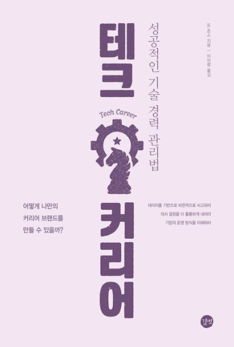                                      | [테크 커리어](테크_커리어/README.md)                                                                            | 돈 존스                                           | ✅ 완료   |
| 07 | 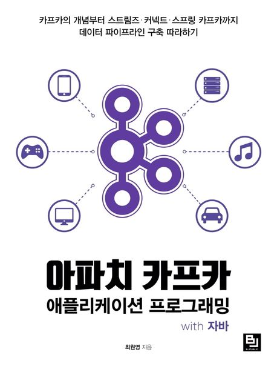                 | [아파치 카프카 애플리케이션 프로그래밍 with 자바](book-apache-kafka-with-java/README.md)                                 | 최원영                                            | ✅ 완료   |
| 08 |         | [스프링 부트 3  백엔드 개발자 되기](book-blog-project-with-spring-boot-3/README.md)                                | 신선영                                            | ✅ 완료   |
| 09 | 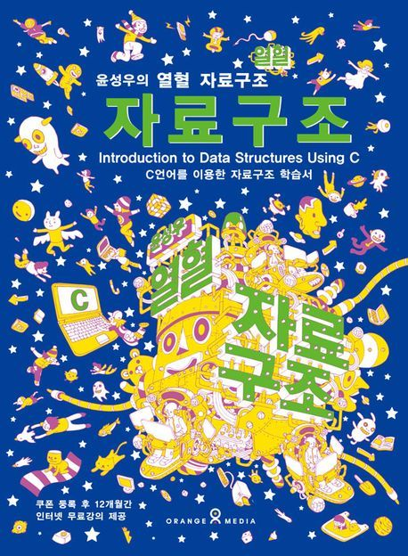                         | [윤성우의 열혈 자료 구조](book-data-structure/README.md)                                                        | 윤성우                                            | ✅ 완료   |
| 10 |              | [헤드 퍼스트 디자인 패턴](book-head-first-design-pattern/README.md)                                             | 에릭 프리먼 , 엘리자베스 롭슨 , 케이시 시에라 , 버트 베이츠           | ✅ 완료   |
| 11 |                          | [자바 웹 프로그래밍 Nest Step](book-java-next-step/README.md)                                                 | 박재성                                            | ✅ 완료   |
| 12 | 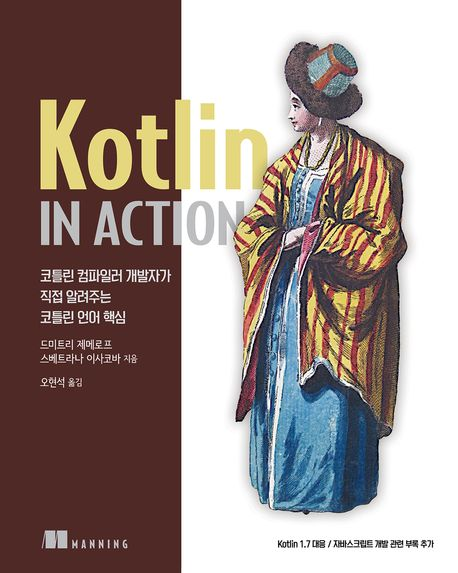                       | [Kotlin in Action](book-kotlin-in-action/README.md)                                                   | 드미트리 제메로프 , 스베트라나 이사코바                         | ✅ 완료   |
| 13 | 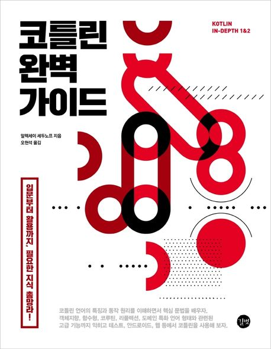                   | [코틀린 완벽 가이드](book-kotlin-perfect-guide/README.md)                                                     | 알렉세이 세두노프                                      | ✅ 완료   |
| 14 | 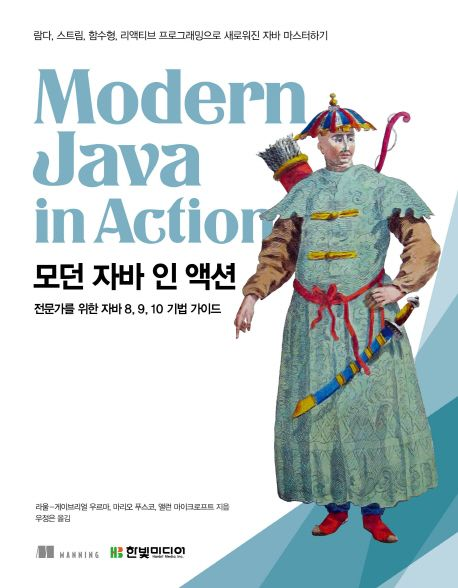                  | [모던 자바 인 액션](book-modern-java-in-action/README.md)                                                    | 라울-게이브리얼 우르마 , 마리오 푸스코 , 앨런 마이크로프트             | ✅ 완료   |
| 15 | 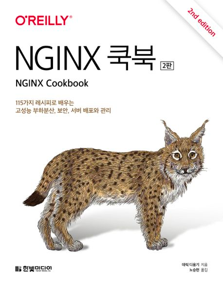                         | [NGINX 쿡북](book-nginx-cookbook/README.md)                                                             | 데릭 디용기                                         | ✅ 완료   |
| 16 |                       | [Nginx Http Server](book-nginx-http-server/README.md)                                                 | 끌레망 네델꾸                                        | ✅ 완료   |
| 17 | 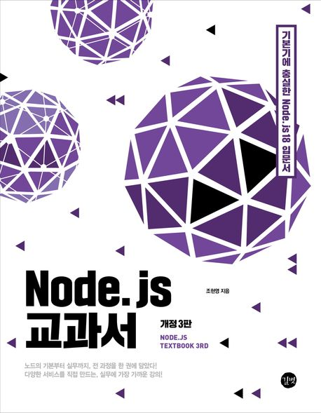                                | [Node.js 교과서](book-nodejs/README.md)                                                                  | 조현영                                            | ✅ 완료   |
| 18 |                           | [자바 ORM 표준 프로그래밍](book-orm-jpa-basic/README.md)                                                       | 김영한                                            | ✅ 완료   |
| 19 |                         | [리팩터링 2판](book-refactoring-2nd/README.md)                                                             | 마틴 파울러                                         | ✅ 완료   |
| 20 | 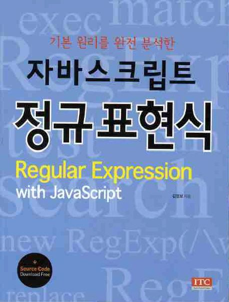                    | [자바스크립트 정규표현식](book-regex-in-javascript/README.md)                                                    | 김영보                                            | ✅ 완료   |
| 21 |                         | [스프링 5 레시피](book-spring-5-recipe/README.md)                                                           | 마틴 데니엄, 다니엘 루비오, 조시 롱                          | ✅ 완료   |
| 22 | 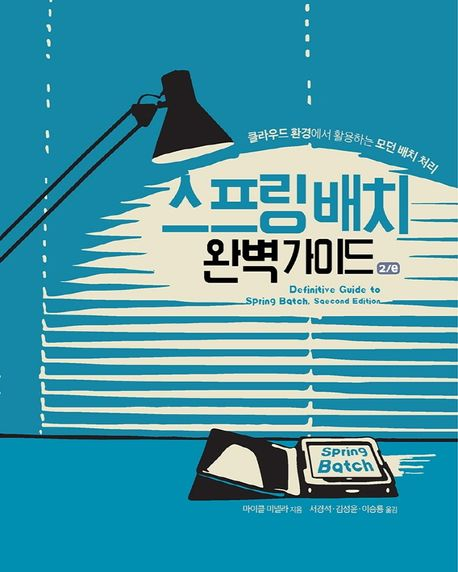             | [스프링 배치 완벽 가이드 2/e](book-spring-batch-perfect-guide/README.md)                                        | 마이클 미넬라                                        | ✅ 완료   |
| 23 | 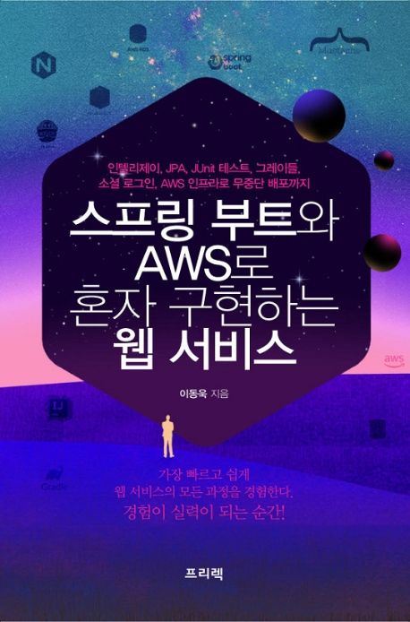                    | [스프링 부트와 AWS로 혼자 구현하는 웹 서비스](book-spring-boot-and-aws/README.md)                                      | 이동욱                                            | ✅ 완료   |
| 24 | 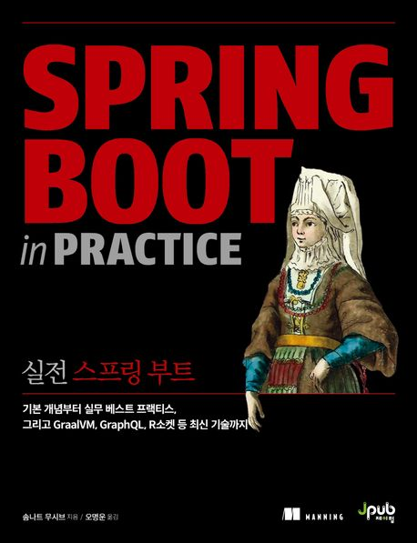                | [실전 스프링 부트](book-spring-boot-in-practice/README.md)                                                   | 솜나트 무시브                                        | ✅ 완료   |
| 25 | 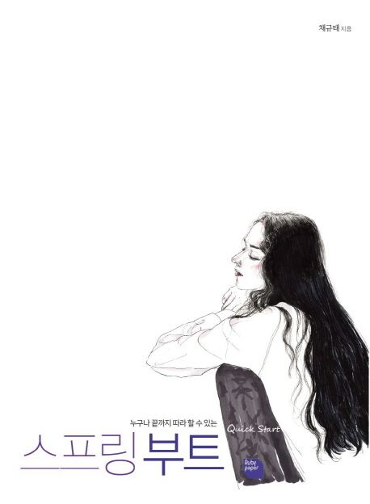                | [스프링 부트 퀵스타트](book-spring-boot-quick-start/README.md)                                                 | 채규태                                            | ✅ 완료   |
| 26 | 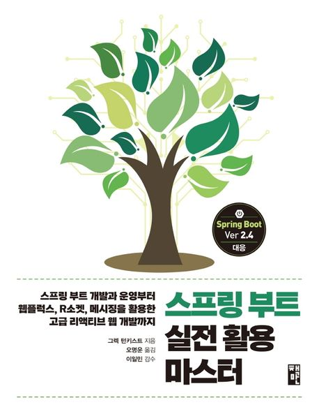                   | [스프링 부트 실전 활용 마스터](book-spring-boot-reactive/README.md)                                               | 그렉 턴키스트                                        | ✅ 완료   |
| 27 | 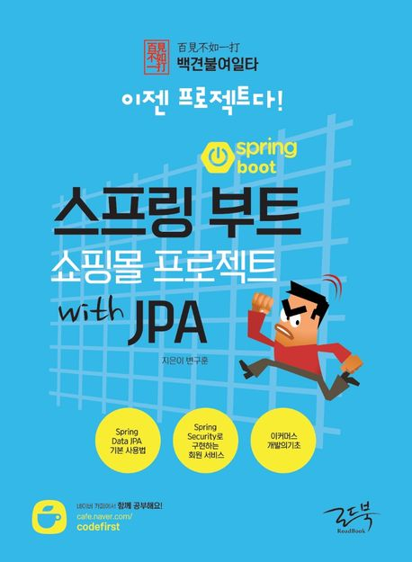     | [스프링 부트 쇼핑몰 프로젝트 with JPA](book-spring-boot-shopping-mall-with-jpa/README.md)                         | 변구훈                                            | ✅ 완료   |
| 28 | 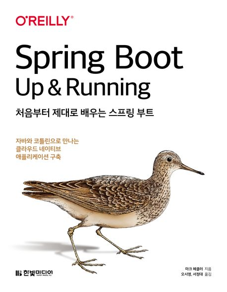             | [처음부터 제대로 배우는 스프링 부트](book-spring-boot-up-and-running/README.md)                                      | 마크 헤클러                                         | ✅ 완료   |
| 29 | 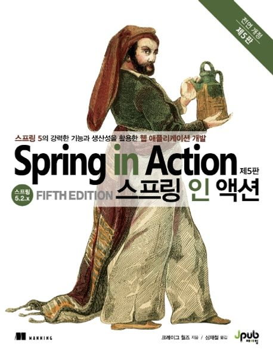                       | [스프링 인 액션](book-spring-in-action/README.md)                                                           | 크레이그 월즈                                        | ✅ 완료   |
| 30 |               | [스프링 시큐리티 인 액션](book-spring-security-in-action/README.md)                                             | 로렌티우 스필카                                       | ✅ 완료   |
| 31 |                         | [코어 자바스크립트](book-core-javascript/README.md)                                                           | 정재남                                            | ✅ 완료   |
| 32 |                         | [스프링 MVC 프로그래밍](book-spring-web-flow/README.md)                                                       | 마틴 데니엄, 코엔 세르닐즈, 콜린 예이츠, 세스 래드, 크리스토프 밴플레테렌    | ✅ 완료   |
| 33 | 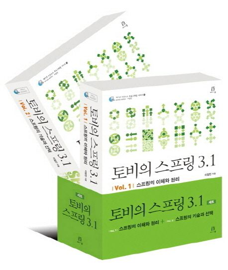                          | [토비의 스프링 3.1 Vol 1 ~ 2](book-tobyspringin5/README.md)                                                 | 이일민                                            | ✅ 완료   |
| 34 | 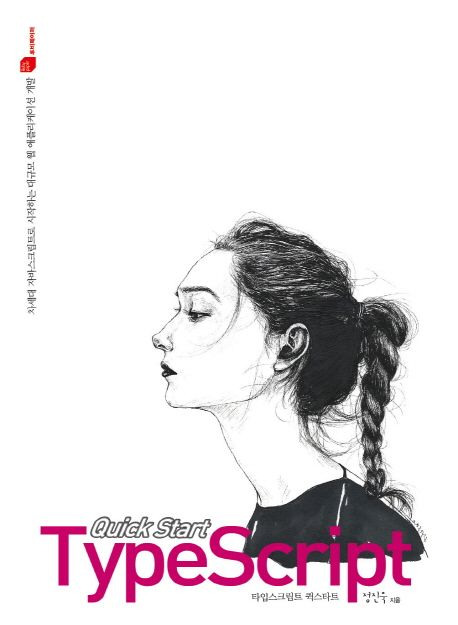                 | [타입스크립트 퀵스타트](book-typescript-quick-start/README.md)                                                  | 정진욱                                            | ✅ 완료   |
| 35 | 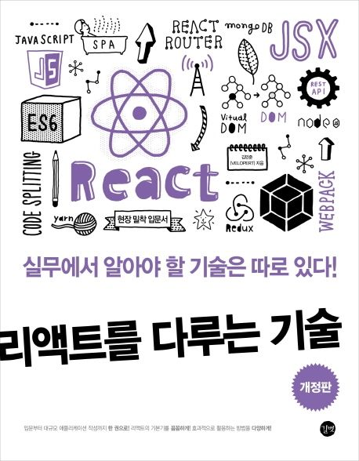                         | [리액트를 다루는 기술](book-velopert-react/README.md)<br/>[리액트를 다루는 기술: Remind](book-velopert-react/README.md) | 김민준                                            | ✅ 완료   |
| 36 | 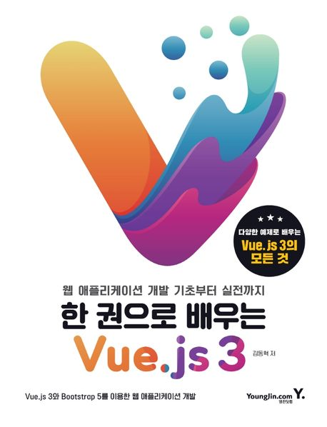                                  | [한 권으로 배우는 Vue.js 3](book-vue-3/README.md)                                                            | 김동혁                                            | ✅ 완료   |
| 37 | 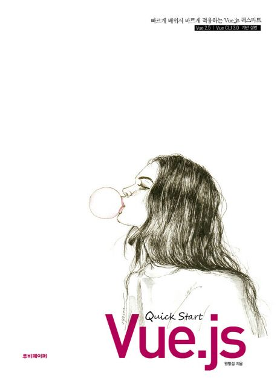                      | [Vue.js 퀵 스타트](book-vuejs-quick-start/README.md)                                                      | 원형섭                                            | ✅ 완료   |
| 38 |             | [스프링으로 시작하는 리액티브 프로그래밍](book-spring-reactive-programming/README.md)                                   | 황정식                                            | 🔄 진행중 |
| 39 |                 | [주니어 백엔드 개발자가 반드시 알아야 할 실무 지식](주니어_백엔드_개발자가_반드시_알아야_할_실무_지식/README.md)                                | 최범균                                            | ✅ 완료   |
| 40 | 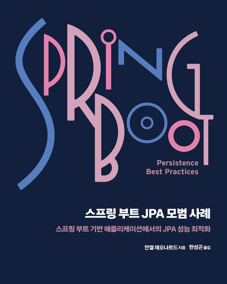 | [스프링 부트 JPA 모범 사례](book-spring-boot-persistence-best-practices/README.md)                             | 안겔 레오나르드                                       | ✅ 완료   |
| 41 |                         | [처음부터 제대로 배우는 도커/쿠버네티스 컨테이너 개발과 운영](도커_쿠버네티스_컨테이너_개발과_운영/README.md)                                   | 야마다 아키노리                                       | ✅ 완료   |
| 42 |                          | [Docs for Developers 기술 문서 작성 완벽 가이드](docs_for_developers/README.md)                                  | 자레드 바티, 재커리 사라 콜라이센, 젠 램본, 데이비드 누네즈, 하이드 워터하우스 | 🔄 진행중 |
| 43 | 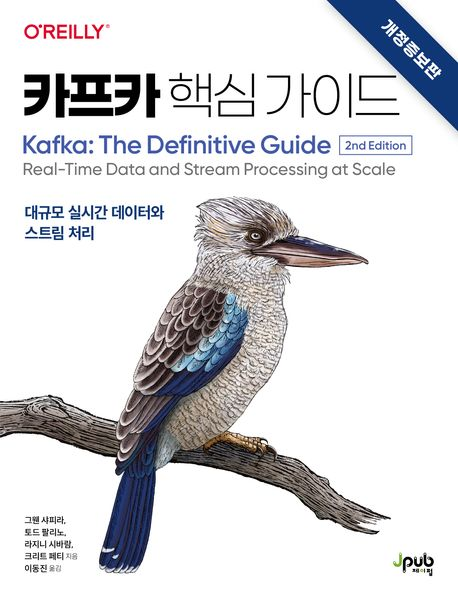             | [카프카 핵심 가이드](book-kafka-the-definitive-guide/README.md)                                               | 그웬 샤피라, 토드 팔리노, 라지니 시바람, 크리트 페티                | 🔄 진행중 |
| 44 |                                    | [실패는 나침반이다](실패는_나침반이다/README.md)                                                                      | 한기용                                            | ✅ 완료   |
| 45 | 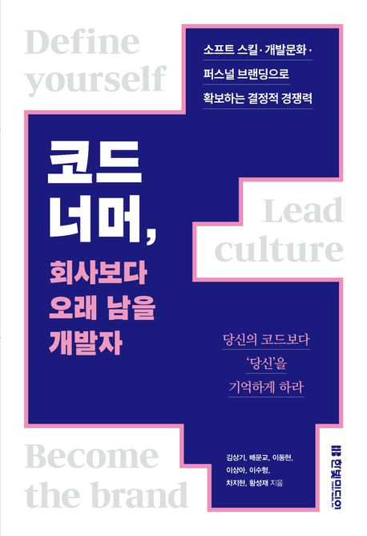                        | [코드 너머, 회사보다 오래 남을 개발자](코드_너머_회사보다_오래_남을_개발자/README.md)                                               | 김상기, 배문교, 이동현, 이상아, 이수형, 차지현, 황성재              | 🔄 진행중 |
| 46 |    | [자바와 JUnit을 활용한 실용주의 단위 테스트](pragmatic-unit-testing-in-java-witn-junit/README.md)                     | 제프 랭어, 앤디 헌트, 데이브 토마스                          | 🔄 진행중 |

## 📅 진행 현황

| 구분      | 전체 |
|---------|----|
| 총       | 46 |
| 완료(✅)   | 41 |
| 진행중(🔄) | 5  |

---
