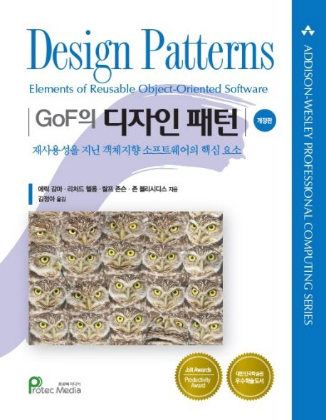

# study-design-pattern

※ 이미지 출처: 교보문고

#### 정보

- 제목: 헤드 퍼스트 디자인 패턴
- 저자: 에릭 프리먼 , 엘리자베스 롭슨 , 케이시 시에라 , 버트 베이츠
- [교보문고 바로 가기](https://product.kyobobook.co.kr/detail/S000001810483)

※ 이미지 출처: 교보문고

#### 정보

- 제목: GoF의 디자인 패턴 :재사용성을 지닌 객체지향 소프트웨어의 핵심요소
- 저자: 에릭 감마 , 리처드 헬름 , 랄프 존슨 , 존 블리시디스
- [교보문고 바로 가기](https://product.kyobobook.co.kr/detail/S000001962303)
