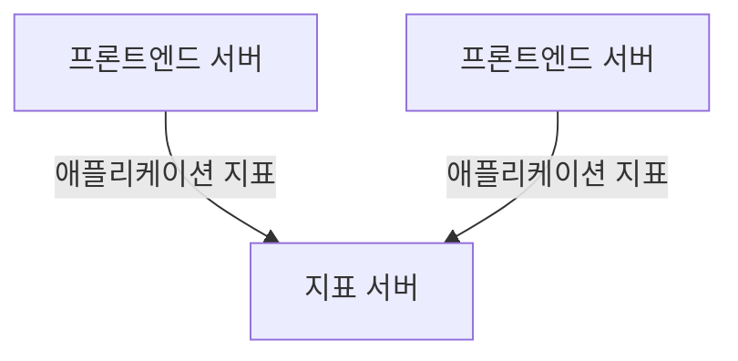
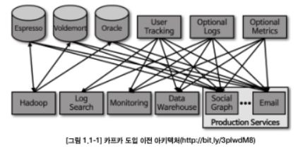
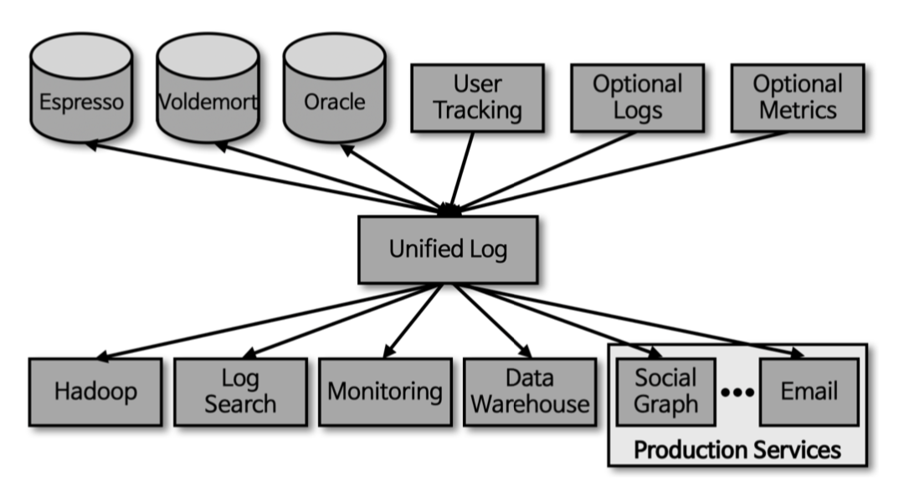

### CHAPTER 1 카프카 시작하기

```markdown
모든 기업은 데이터로 움직인다.
우리는 정보를 얻고, 분석하고, 가공하고, 그 이상의 것을 결과물로 산출한다.
로그 메시지, 지표(metric), 사용자 행동, 외부로 나가는 메시지, 그 외의 어떠한 것이 되었던 간에 모든 애플리케이션은 데이터를 생성한다.
데이터의 모든 부분은 의미가 있으며, 그 다음 처리되어야 하는 작업과 같이 뭔가 중요한 정보를 담고 있다.
이것이 무엇인지 알기 위해서는 데이터를 생성된 곳에서 분석할 수 있는 곳으로 옮겨야 한다.

...

이러한 작업을 더 빠르게 해낼수록 조직은 더 유연해지고 더 민첩해질 수 있다.
우리가 데이터를 이동시키는 작업에 더 적은 노력을 들일수록 핵심 비즈니스에 더욱 집중할 수 있다.

...

데이터를 어떻게 이동시키느냐의 문제는 데이터 그 자체만큼이나 중요한 것이다.
```


## 발행/구독 메시지 전달
```markdown
발행/구독 메시지 전달 패턴의 특징은 전송자(발행하는 쪽)가 데이터(메시지)를 보낼 때 직접 수신자(구동하는 쪽)로 보내지 않는다는 것이다.
대신, 전송자(쓰는 쪽)는 어떤 형태로든 메시지를 분류해서 보내고, 수신자(읽는 쪽)는 이렇게 분류된 메시지를 구독한다.
발행/구독 시스템에는 대개 발행된 메시지를 전달받고 중계해주는 중간 지점 역할을 하는 브로커(broker)가 있다.
```

### 초기의 발행/구독 시스템
```markdown
발행/구독 패턴을 따르는 많은 사례뜰은 비슷한 형태로 시작한다. 즉, 가운데 간단한 메시지 큐나 프로세스 간 통신 채널을 놓는 것이다.
```



```markdown
지표를 받아서 저장하고, 분석하는 서비스를 새로 하나 만든다.
이 서비스가 작동하도록 하기 위해서는 애플리케이션을 고쳐서 두 시스템에 지푯값을 쓰게 만든다.
그리고 지표를 생성하는 애플리케이션이 세 개가 되면, 이 두 서비스에 똑같은 연결을 또 만든다.

...

결과적으로 다음과 같은 아키텍처가 되는데, 이렇게 되면 연결을 추적하는 것은 더 힘들어진다.
```



```markdown
이러한 방식에서 기술 부채(technical debt)는 명백하기 때문에 다소 개선의 필요가 있다.
모든 애플리케이션으로부터 지표를 받는 하나의 애플리케이션을 만들고, 이 지푯값들을 필요로 하는 어느 시스템이든 지표를 질의할 수 있도록 해주는 서버를 제공하면 된다.
이러헥 하면 다음과 같이 복잡성이 줄어든 아키텍처를 만들 수 있다.
```




### 개별 메시지 큐 시스템
```markdown
지표를 다루는 것과 동시에 로그 메시지에 대해서도 비슷한 작업을 해줘야 한다.
또한, 프론트엔드 웹사이트에서의 사용자 활동을 추적해서 이 정보를 ML(머신러닝) 개발자에게 제공하거나 관리자용 보고서를 생성하는 데 사용해야 할 수도 있다.
이러한 경우에도 비슷한 시스템을 구성함으로써 정보의 발행자와 구독자를 분리할 수 있다.
```


```markdown
하지만 이 구조에는 중복이 많다. 이렇게 되면 버그도 한계도 제각각인 다수의 데이터 큐 시스템을 유지보수해야 한다.

...

비즈니스가 확장됨에 따라 함께 확장되는, 일반화된 유형의 데이터를 발행하고 구독할 수 있는 중앙 집중화된 시스템이 필요하다.
```


## 카프카 입문
```markdown
아파치 카프카는 위에서 설명한 것과 같은 문제를 해결하기 위해 고안된 메시지 발행/구독 시스템이다.
'분산 커밋 로그' 혹은 '분산 스트리밍 플랫폼'이라고 불리기도 한다.

...

카프카에 저장된 데이터는 순서를 유지한채로 지속성 있게 보관되며 결정적(deterministic)으로 읽을 수 있다.
또한, 확장시 성능을 향상시키고 실패가 발생하더라도 데이터 사용에는 문제가 없도록 시스템 안에서 데이터를 분산시켜 저장할 수 있다.
```

### 메시지와 배치
```markdown
카프카에서 데이터의 기본 단위는 메시지(message)다.

...

카프카의 입장에서 메시지는 단순히 바이트의 배열일 뿐이기 때문에 여기에 포함된 데이터에는 특정한 형식이나 의미가 없다.
메시지는 키(key)라 불리는 메타데이터를 포함할 수 있다.
키 역시 메시지와 마찬가지로 카프카 입장에서 특별한 의미가 없는 바이트 배열일 뿐이다.
키는 메시지를 저장할 파티션을 결정하기 위해 사용된다.

...

카프카는 효율성을 위해 메시지를 배치(batch) 단위로 저장한다.

...

메시지를 쓸 때마다 네트워크상에서 신호가 오가는 것은 막대한 오버헤드를 발생시키는데, 메시지를 배치 단위로 모아서 쓰면 이것을 줄일 수 있다.

...

배치는 더 효율적인 데이터 전송과 저장을 위해 약간의 처리 능력을 들여서 압축되는 경우가 많다.
```

### 스키마
```markdown
카프카 입장에서 메시지는 단순한 바이트 배열일 뿐이지만, 내용을 이해하기 쉽도록 일정한 구조(혹은 스키마)를 부여하는 것이 권장된다.

...

가장 간단한 방법으로는 쓰기 쉽고 사람이 알아볼 수 있는 JSON이나 XML이 있다.
하지만 이 방식들은 타입 처리 기능이나 스키마 버전 간의 호환성 유지 기능이 떨어진다.
많은 아파치 카프카 개발자들은 아파치 에이브로(Avro)를 선호한다.
에이브로는 조밀한 직렬화 형식을 제공하는 데다 메시지 본체와 스키마를 분리하기 때문에 스키마가 변경되더라도 코드를 생성할 필요가 없다.
강력한 데이터 타이핑과 스키마 변경에 따른 상위 호환성, 하위 호환성 역시 지원한다.
카프카에서는 일관적인 데이터 형식이 중요하다.
메시지 쓰기와 읽기 작업을 분리할 수 있도록 해주기 때문이다.

...

잘 정의된 스키마를 공유 저장소에 저장함으로써 카프카는 두 버전 형식을 동시에 지원하도록 하는 작업 없이도 메시지를 처리할 수 있다.
```

### 토픽과 파티션
```markdown
카프카에 저장되는 메시지는 토픽(topic) 단위로 분류된다.

...

토픽은 다시 여러 개의 파티션(partition)으로 나뉘어진다.
커밋 로그의 관점으로 되돌아가자면, 파티션은 하나의 로그에 해당한다.
파티션에 메시지가 쓰여질 때는 추가만 가능(append-only)한 형태로 쓰여지며, 읽을 떄는 맨 앞부터 제일 끝까지의 순서로 읽힌다.

...

파티션은 카프카가 데이터 중복과 확장성을 제공하는 방법이기도 하다.
각 파티션이 서로 다른 서버에 저장될 수 있기 때문에 하나의 토픽이 여러 개의 서버로 수평적으로 확장되어 하나의 서버의 용량을 넘어가는 성능을 보여 줄 수 있다.
파티션은 복제될 수 있다.
즉, 서로 다른 서버들이 동일한 파티션의 복제본을 저장하고 있기 때문에 서버 중 하나에 장애가 발생한다고 해서 읽거나 쓸 수 없는 상황이 벌어지지는 않는다.
카프카와 같은 시스템을 이야기할 때면 '스트림(stream)'이라는 용어가 자주 사용된다.
대부분의 경우 스트림은 (파티션의 개수와 상관없이) 하나의 토픽에 저장된 데이터로 간주되며, 프로듀서(producer)로부터 컨슈머(consumer)로의 하나의 데이터 흐름을 나타낸다.
```

### 프로듀서와 컨슈머
```markdown
프로듀서는 새로운 메시지를 생성한다.
다른 발행/구독 시스템에서는 발행자(publisher) 혹은 작성자(writer)라고도 부른다.
메시지는 특정한 토픽에 쓰여진다.

...

동일한 키 값을 가진 모든 메시지는 같은 파티션에 저장되게 된다.

컨슈머는 메시지를 읽는다.
다른 발행/구독 시스템에서는 구독자(subscriber) 혹은 독자(reader)라고도 한다.
컨슈머는 1개 이상의 토픽을 구독해서 여기에 저장된 메시지들을 각 파티션에 쓰여진 순서대로 읽어 온다.
컨슈머는 메시지의 오프셋(offset)을 기록함으로써 어느 메시지까지 읽었는지를 유지한다.

...

파티션별로 다음 번에 사용 가능한 오프셋 값을 저장함으로써 컨슈머는 읽기 작업을 정지했다가 다시 시작하더라도 마지막으로 읽었던 메시지의 바로 다음 메시지부터 읽을 수 있다.

컨슈머는 컨슈머 그룹(consumer group)의 일원으로서 작동한다.
컨슈머 그룹은 토픽에 저장된 데이터를 읽어오기 위해 협업하는 하나 이상의 컨슈머로 이루어진다.
컨슈머 그룹은 각 파티션이 하나의 컨슈머에 의해서만 읽히도록 한다.

...

컨슈머 중 하나에 장애가 발생하더라도, 그룹 안의 다른 컨슈머들이 장애가 발생한 컨슈가 읽고 있던 파티션을 재할당받은 뒤 이어서 데이터를 읽어올 수 있다.
```

### 브로커와 클러스터
```markdown
하나의 카프카 서버를 브로커(broker)라고 부른다.
브로커는 프로듀서로부터 메시지를 전달받아 오프셋을 할당한 뒤 디스크 저장소에 쓴다.
브로커는 컨슈머의 파티션 읽기(fetch) 요청 역시 처리하고 발행된 메시지를 보내준다.

...

카프카 브로커는 클러스터의 일부로서 작동하도록 설계되었다.
하나의 클러스터 안에 여러 개의 브로커가 포함될 수 있으며, 그중 하나의 브로커가 클러스터 컨트롤러의 역할을 하게 된다.(컨트롤러는 클러스터 안의 현재 작동 중인 브로커 중 하나가 자동으로 선정된다.)
컨트롤러는 파티션을 브로커에 할당해주거나 장애가 발생한 브로커를 모니터링하는 등의 관리 기능을 담당한다.
파티션은 클러스터 안의 브로커 중 하나가 담당하며, 그 브로커를 파티션 리더(partition leader)라고 부른다.
복제된 파티션이 여러 브로커에 할당될 수도 있는데 이것들은 파티션의 팔로워(follower)라고 부른다.
복제(replication) 기능은 파티션의 메시지를 중복 저장함으로써 리더 브로커에 장애가 발생했을 때 팔로워 중 하나가 리더 역할을 이어받을 수 있도록 한다.
모든 프로듀서는 리더 브로커에 메시지를 발행해야 하지만, 컨슈머는 리더나 팔로워 중 하나로부터 데이터를 읽어올 수 있다.
아파치 카프카의 핵심 기능 중에 일정 기간 동안 메시지를 지속성(durability) 있게 보관하는 보존(retention) 기능이 있다.

...

토픽에는 로그 압착(log compaction) 기능을 설정할 수도 있는데, 이 경우 같은 키를 갖는 메시지 중 가장 최신의 것만 보존된다.
```


### 다중 클러스터
```markdown
다수의 클러스터를 운용할 경우 아래와 같은 장점이 있다.
- 데이터 유형별 분리
- 보안 요구사항을 충족시키기 위한 격리
- 재해 복구(disaster recovery, DR)를 대비한 다중 데이터센터

...

카프카 클러스터의 복제 메커니즘은 다중 클러스터 사이에서가 아닌 하나의 클러스터 안에서만 작동하도록 설계되었다.
카프카 프로젝트는 데이터를 다른 클러스터로 복제하는 데 사용되는 미러메이커(MirrorMaker)라는 툴을 포함한다.
근본적으로 미러메이커도 단지 큐로 연결된 카프카 컨슈머와 프로듀서에 불과하다.
```


## 왜 카프카인가?

### 다중 프로듀서
```markdown
카프카는 자연스럽게 여러 프로듀서를 처리할 수 있다.

...

이러한 이유 때문에 많은 프론트엔드 시스템으로부터 데이터를 수집하고 일관성을 유지하는 데 적격이다.
```

### 다중 컨슈머
```markdown
다중 프로듀서와 함께, 카프카는 많은 컨슈머가 상호 간섭 없이 어떠한 메시지 스트림도 읽을 수 있도록 설계되었다.
이것이 하나의 메시지를 하나의 클라이언트에서만 소비할 수 있도록 되어 있는 많은 큐(queue) 시스템과의 결정적인 차이점이기도 하다.
다수의 카프카 컨슈먼는 컨슈머 그룹의 일원으로 작동함으로써 하나의 스트림을 여럿이서 나눠서 읽을 수 있다.
이 경우 주어진 메시지는 전체 컨슈머 그룹에 대해 한 번만 처리된다.
```

### 디스크 기반 보존
```markdown
카프카는 다중 컨슈머를 처리할 수 있을 뿐만 아니라 메시지를 지속성 있게 저장할 수도 있다.
이는 컨슈머들이 항상 실시간으로 데이터를 읽어올 필요는 없다는 의미이기도 하다.

...

만약 컨슈머가 느린 처리 속도 혹은 트래픽 폭주로 인해 뒤처질 경우에도 데이터 유실의 위험은 없다.
프로듀서 쪽에서 메시지를 백업해야 하거나 메시지가 유실될 걱정 없이 잠시 애플리케이션을 내리고 컨슈머를 유지보수 할 수 있는 것이다.
컨슈머를 정지하더라도 메시지는 카프카 안에 남아있게 된다.
그리고 컨슈머가 다시 시작되면 작업을 멈춘 지점에서부터 유실 없이 데이터를 처리할 수 있다.
```

### 확장성
```markdown
카프카는 유연한 확장성을 가지고 있기 때문에 어떠한 크기의 데이터도 쉽게 처리할 수 있다.

...

카프카 클러스터는 작동 중에도 시스템 전체의 가용성(availability)에 영향을 주지 않으면서 확장이 가능하다.
여러 대의 브로커로 구성된 클러스터는 개별 브로커의 장애를 처리하면서 지속적으로 클라이언트의 요청을 받아서 처리할 수 있다는 의미다.
```


### 고성능
```markdown
아파치 파크파가 고부하 아래에서도 높은 성능을 보여주는 발행/구독 메시지 전달 시스템이 될 수 있었던 것은 지금까지 설명한 모든 특징들 덕분이다.
```


### 플랫폼 기능
```markdown
아파치 카프카의 코어 프로젝트에는 개발자들이 자주 하는 작업을 훨씬 쉽게 수행할 수 있도록 해주는 플랫폼 기능이 추가되어 있다.

...

카프카 커넥트는 소스 데이터 시스템으로부터 카프카로 데이터를 가져오거나 카프카의 데이터를 싱크 시스템으로 내보내는 작업을 도와준다.
카프카 스트림즈는 규모 가변성(scalability)과 내고장성(ault tolerance)을 갖춘 스트림 처리 애플리케이션을 쉽게 개발할 수 있게 해주는 라이브러리다.
```


## 데이터 생태계
```markdown
아파치 카프카는 데이터 생태계에 있어서 순환 시스템을 제공한다.
모든 클라이언트에 대해 일관된 인터페이스를 제공하면서 다양한 인프라스트럭처 요소들 사이에 메시지를 전달하는 것이다.
메시지 스키마를 제공하는 시스템과 결합하면 프로듀서와 컨슈머는 더 이상 어떤 형태로든 밀접하게 결합되거나 연결될 필요가 없다.
필요할 때마다 관련 컴포넌트를 추가하거나 제거해주면 되며, 프로듀서는 누가 데이터를 사용하는지, 컨슈머 애플리케이션이 몇 개인지와 같은 것에 신경쓸 필요가 없다.
```


### 이용 사례
- 활동 추적
```markdown
링크드인에서 처음 의도했던 카프카의 원래 용도는 사용자 활동 추적이었다.
웹사이트의 사용자가 뭔가 행동을 할 때마다 이것에 대한 메시지를 생성하는 프론트엔드 애플리케이션이 작동한다.

...

이 메시지들은 하나 이상의 토픽으로 발행되어 백엔드에서 작동 중인 애플리케이션에 전달된다.
```

- 메시지 교환
```markdown
카프카는 메시지를 교환하는 데도 사용될 수 있기 때문에, 사용자에게 (이메일과 같은) 알림을 보내야하는 애플리케이션에서 활용할 수 있다.
이러한 애플리케이션들은 메시지 형식이나 전송 방법에 신경 쓸 필요 없이 메시지를 생성할 수 있다.
```

- 지표 및 로그 수집
```markdown
카프카는 애플리케이션과 시스템의 지푯값과 로그를 수집하는 데도 이상적이다.

...

애플리케이션이 정기적으로 지푯값을 카프카 토픽에 발행하면, 모니터링과 경보를 맡고 있는 시스템이 이 지푯값들을 가져다 사용하는 것이다.

...

또 다른 이점은 목적 시스템을 변경해야 할 때(예를 들어서, 로그 저장 시스템을 변경해야 할 때가 되었다든가), 프론트엔드 애플리케이션이나 메시지 수집 방법을 변경할 필요가 없다는 것이다.
```

- 커밋 로그
```markdown
카프카가 데이터베이스의 커밋 로그 개념을 기반으로 만들어진 만큼, 
데이터베이스에 가해진 변경점들이 (스트림의 형태로) 카프카로 발행될 수 있으며 
애플리케이션은 이 스트림을 지켜봄으로써 쉽게 실시간 업데이트를 받아볼 수 있다.
```

- 스트림 처리
```markdown
스트림 처리 프레임워크를 사용하면 카프카 메시지를 처리하는 작은 애플리케이션을 작성하거나, 각종 지푯값을 계산하는 것과 같은 작업을 수행하거나,
다른 애플리케이션이 효율적으로 처리할 수 있게 메시지를 파티셔닝하거나, 다수의 원본으로부터 들어온 데이터를 사용해서 메시지를 변환한다거나 할 수 있다.
```