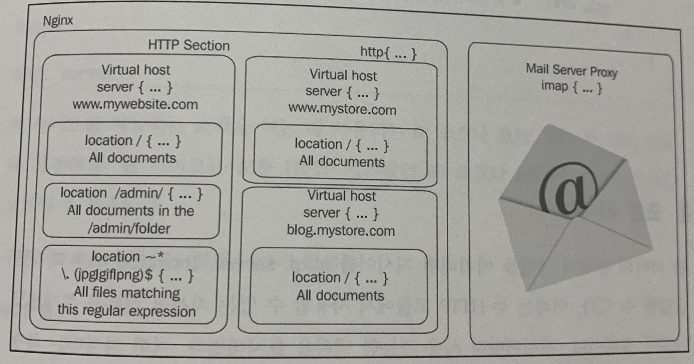

### HTTP 핵심 모듈

```
HTTP 핵심 모듈은 HTTP 서버의 모든 기반 블록, 지시어, 변수를 포함하는 구성 요소입니다.
이 모듈은 엔진엑스를 컴파일하고자 구성할 때 기본적으로 활성화 됩니다.
```

#### 구조 블록
```
HTTP 모듈은 새로운 세 개의 논리 블록을 제공합니다.
```

#### http
- 이 블록은 구성 파일의 최상위에 삽입됩니다.
- 엔진엑스의 HTTP와 관련된 모듈 전부의 지시어와 블록은 http 블록안에서만 정의할 수 있습니다.
- 이 블록은 여러 번 추가될 수 있는데, 이런 경우 뒤에 오는 블록의 지시어 값이 선행되는 블록의 지시어 값을 재지정하게 됩니다.

#### server
- 이 블록으로는 웹 사이트 하나를 선언할 수 있습니다.
- 엔진엑스가 특정 웹 사이트를 인식하고 그 구성을 얻는 블록입니다.
- 이 블록은 http 블록 안에서만 사용할 수 있습니다.

#### location
- 웹 사이트의 특정 위치에만 적용되는 설정을 정의하는 데 쓰는 블록입니다.
- 이 블록은 server 블록 안이나 다른 location 블록 안에 중첩해서 사용할 수 있습니다.



### ex
```
http {
    # http 블록 수준에서 gzip 압축 활성화
    gzip on;
    
    server {
        server_name localhost;
        listen 80;
        
        # 하위 블록에서도 gzip은 여전히 활성화
        
        location /downloads/ {
            gzip off;   # 이 지시어는 /downloads/ 안의 문서에만 적용됩니다.
        }
    }
}
```