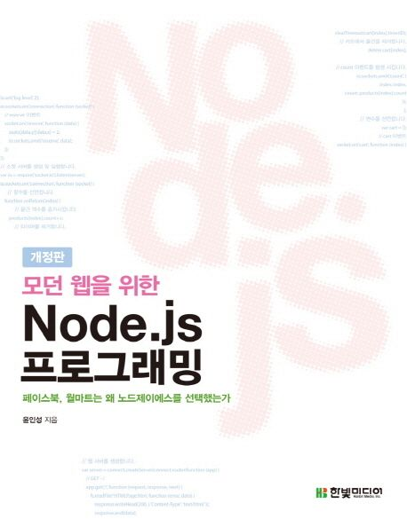

# study-node

※ 이미지 출처: 교보문고

#### 정보

- 제목: 모던 웹을 위한 Node.js 프로그래밍
- 저자: 윤인성
- [교보문고 바로 가기](https://product.kyobobook.co.kr/detail/S000001057467)

※ 이미지 출처: 교보문고

#### 정보

- 제목: Node.js 교과서
- 저자: 조현영
- [교보문고 바로 가기](https://product.kyobobook.co.kr/detail/S000200437346)
