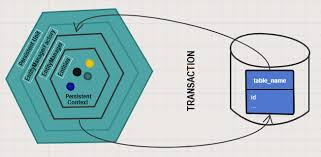

## (하이버네이트) JPA 기본 사항

### 영속성 유닛이란?
- 영속성 유닛은 EntityManagerFactory 인스턴스를 생성하는 데 필요한 모든 정보가 담긴 상자라고 생각하면 된다.

- 이 정보 중에는 데이터 소스, 관리되는 엔티티 목록, 기타 속성에 대한 정보 등이 있으며, 당연히 영속성 유닛의 트랜잭션 타입은 resource-local이거나 JTA일 수 있다.

### EntityManagerFactory란?
- EntityManagerFactory는 온디맨드(on-demand) EntityManager 인스턴스를 생성하는 팩토리다.
- 기본적으로 영속성 유닛으로 제공된 정보를 통해 호출될 때마다 애플리케이션에서 관리되는 새로운 EntityManager 인스턴스를 반환하는 createEntityManager()라는 메서드를 제공한다.
- isOpened() 메서드를 통해 EntityManagerFactory의 상태를 확인하고 close() 메서드를 통해 닫을 수 있다.
- EntityManagerFactory를 닫으면 모든 엔티티 관리자는 닫힌 상태로 간주된다.
