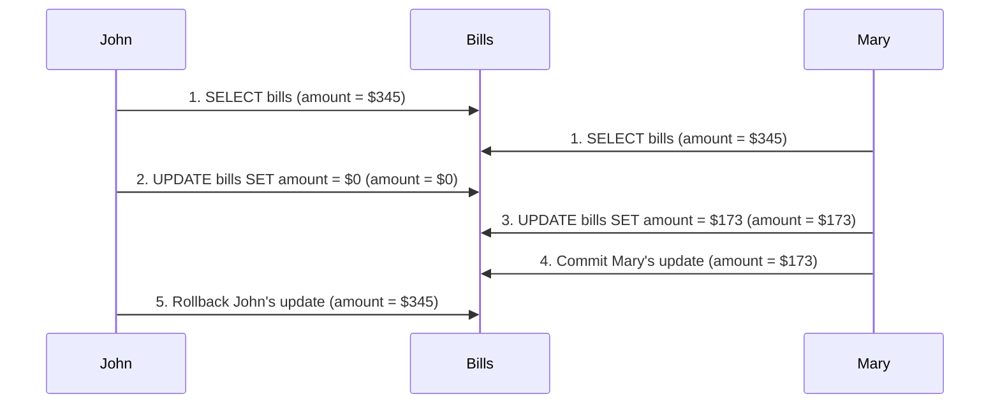
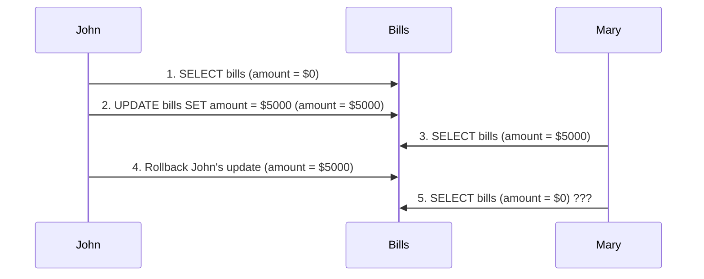
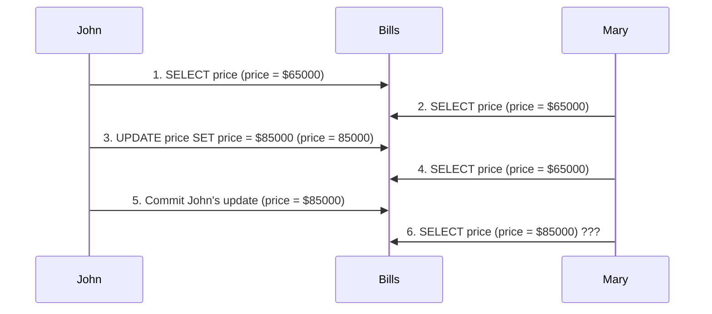
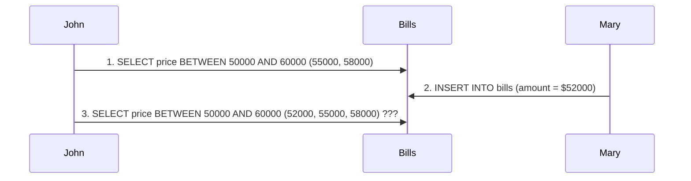

## SQL 현상

- SQL 현상(phenomena) 또는 이상 현상(anomalies)는 다음과 같다.
  - 더티 읽기 (Dirty Reads)
  - 반복 불가능한 읽기 (Non-repeatable Reads)
  - 팬텀 읽기 (Phantom Reads)
  - 더티 쓰기 (Dirty Writes)
  - 읽기 왜곡 (Reading Skews)
  - 쓰기 왜곡 (Writing Skews)
  - 업데이트 손실 (Lost Updates)

>이런 현상들은 SERIALIZABLE 격리 수준을 완화된 다른 격리 수준으로 트랜잭션 동시성을 처리해
>성능을 끌어올리려고 할 때 발생되는 일련의 데이터 무결성 이상을 나타낸다.

### 더티 쓰기
- 더티 쓰기는 업데이트 손실이며, 이 상황에서는 트랜잭션이 다른 트랜잭션을 덮어쓴다.
- 즉, 두 트랜잭션이 동시에 동일한 행에 영향을 미칠 때에 발생한다.

>기본적으로 모든 데이터베이스 시스템은 (READ_UNCOMMITTED 격리 수준에서도) 더티 쓰기를 방지한다.

### 더티 읽기
- 더티 읽기는 일반적으로 READ_UNCOMMITTED 격리 수준과 연관되며, 이 케이스에서는 최종적으로 롤백되는 다른 동시 트랜잭션의 커밋되지 않은 수정 사항을 읽는다.

### 반복 불가능한 읽기
- 반복 불가능한 읽기는 일반적으로 READ_COMMITTED 격리 수준과 연관된다.
- 동시 트랜잭션이 동일한 레코드를 쓰고 커밋하는 동안 다른 트랜잭션은 해당 레코드를 읽는다.
- 나중에 첫 번째 트랜잭션은 똑같은 레코드를 이후 다시 읽을 때 다른 값을 얻는다.

>반복 불가능 읽기는 현재 트랜잭션이 첫 번째 읽은 값을 기반으로 비즈니스 결정을 내릴 때 문제가 될 수 있다.
>한 가지 해결책은 격리 수준을 REPEATABLE_READ 또는 SERIALIZABLE로 설정하는 것이다.
>또는 READ_COMMITTED를 유지하면서 명시적으로 SELECT FOR SHARE를 통해 공유 잠금을 획득할 수 있다.

### 팬텀 읽기
- 팬텀 읽기는 일반적으로 REPEATABLE_READ 격리 수준과 연관되며, 트랜잭션은 조건에 따라 레코드의 범위를 읽는다.

>이 현상은 SERIALIZABLE 격리 수준 또는 MVCC 일관된 스냅숏을 통해 방지할 수 있다.

### 읽기 왜곡
- 읽기 왜곡은 최소 2개의 테이블과 관련된 이상 현상이다.

>트랜잭션은 첫 번째 테이블에서 데이터를 읽고 이후 동시 트랜잭션은 동기화된 두 테이블을 업데이트한다.
>두 테이블이 모두 업데이트된 후 첫 번째 트랜잭션은 다시 두 번째 테이블에서 데이터를 읽는다.
>첫 번째 트랜잭션은 1 테이블의 이전 버전과 관련, 2 테이블의 최신 버전을 보게 된다.

- 모든 읽기에서 공유 잠금을 획득하거나 REPEATABLE_READ 격리 수준 또는 SERIALIZABLE의 MVCC 구현을 통해 읽기 왜곡을 방지할 수 있다.

### 쓰기 왜곡
- 쓰기 왜곡은 최소 2개의 테이블과 관련된 이상 현상으로,
- 두 테이블 모두 동기식으로 업데이트돼야 하지만 쓰기 왜곡으로 인해 2개의 동시 트랜잭션이 해당 제약을 깨뜨릴 수 있다.

### 업데이트 손실
- 업데이트 손실은 데이터 무결성에 심각한 영향을 줄 수 있는 유명한 이상 현상이다.
- 트랜잭션은 레코드를 읽고 이 정보를 사용해 비즈니스 의사 결정을 내리는 동안 동시 트랜잭션이 해당 레코드를 수정하고 커밋했음을 인지하지 못한다.
- 첫 번째 트랜잭션이 커밋될 때 업데이트 손실을 전혀 인식하지 못하고, 이로 인해 데이터 무결성 문제가 발생한다.

>이 이상 현상은 READ_COMMITTED 격리 수준에 영향을 미치며 REPEATABLE_READ 또는 SERIALIZABLE 격리 수준을 설정해 방지할 수 있다.
>MVCC가 없는 REPEATABLE_READ 격리 수준의 경우 데이터베이스는 공유 잠금을 사용해 이미 가져온 레코드를 수정하려는 다른 트랜잭션의 시도를 거부한다.

