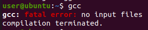
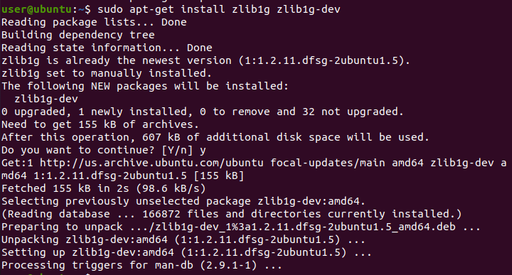
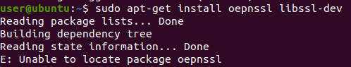
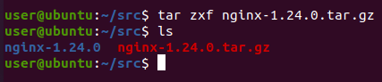
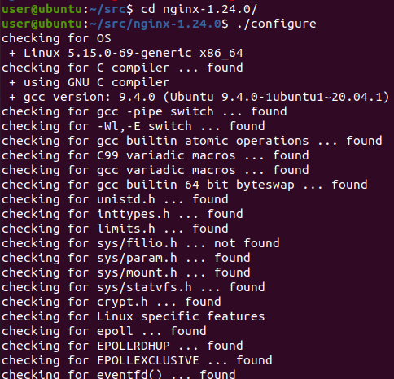

## Nginx 설치

```
Nginx 설치 방법은 크게 3가지 방법이 있습니다.
    1. Debian(데비안) 기반의 운영체제에서는 apt-get install nginx
    2. Red Hat(레드햇) 기반의 운영체제에서는 yum install nginx
    ★ 3. Nginx 소스 코드를 직접 다운로드하여 설치
```

### Nginx 소스 코드로 직접 설치하기

```
Nginx가 C로 작성된 프로그램이기 때문에 GCC 같은 컴파일러 도구가 필요합니다.
```

### GCC 설치 여부 확인


```
💡패키지 관리자는 root 권한이 필요하기 떄문에 root 계정으로 로그인하거나 sudo 명령어로 실행해야 합니다.💡

GCC 설치
    1. Red Hat(레드햇) 기반의 운영체제에서는 yum groupinstall "Development Tools"
    2. Debian(데비안) 기반의 운영체제에서는 apt-get install build-essential  
```



```
설치 후 위와 같이 출력되면 설치 성공입니다.
```

### PCRE 라이브러리
```
엔진엑스를 컴파일하는 데 PCRE(펄 호환 정규 표현식)(Perl Compatible Regular Expression) 라이브러리가 필요합니다.
엔진엑스의 URL 재작성(rewrite) 모듈과 HTTP 핵심 모듈은 PCRE를 정규식 구문에 사용합니다.

pcre, pcre-devel라는 두 가지 패키지를 설치해야 합니다.
pcre: 라이브러리의 컴파일된 버전을 제공
pcre-devel: 프로젝트를 컴파일하는 데 필요한 헤더 파일과 소스를 제공
```

### pcre, pcre-devel 설치
```
    1. Red Hat(레드햇) 기반의 운영체제에서는 yum intall pcre pcre-devel 또는 intall pcre*
    2. Debian(데비안) 기반의 운영체제에서는 apt-get install libpcre3 libpcre3-dev
```

### zlib 라이브러리
```
zlib 라이브러리는 압축 알고리즘을 제공하는데, 엔진엑스의 다양한 모듈에서 gzip 압축을 하는 데 필요합니다.
PCRE와 비슷하게 라이브러리와 라이브러리 소스인 zlib와 zlib-devel이 필요합니다.

    1. Red Hat(레드햇) 기반의 운영체제에서는 yum intall zlib zlib-devel 또는 intall zlib*
    2. Debian(데비안) 기반의 운영체제에서는 apt-get install zlib1g zlib1g-dev
```


### OpenSSl
```
OpenSSL 라이브러리는 엔진엑스가 안전한 연결을 통해 웹 페이지를 제공하는 데 사용됩니다.
따라서 이 라이브러리와 라이브러리의 개발 패키지를 설치해야 합니다.

    1. Red Hat(레드햇) 기반의 운영체제에서는 yum intall openssl openssl-devel
    2. Debian(데비안) 기반의 운영체제에서는 apt-get install oepnssl libssl-dev
```


### Nginx 파일 다운로드
```
Nginx 1.24.0 버전이 2023년 4월 11일 stable 되었다고 합니다.
이 버전으로 다운로드 해보겠습니다.
```
[Nginx 다운로드 페이지](https://nginx.org/en/download.html)

```
mkdir src && cd src
wget http://nginx.org/download/nginx-1.24.0.tar.gz
tar zxf nginx-1.24.0.tar.gz
```




### Nginx 설치
```
cd nginx-1.24.0
./configure
make
make install
```



### Nginx 경로 설정
```
cd nginx-1.24.0
./configure --conf-path=/etc/nginx/nginx.conf
```