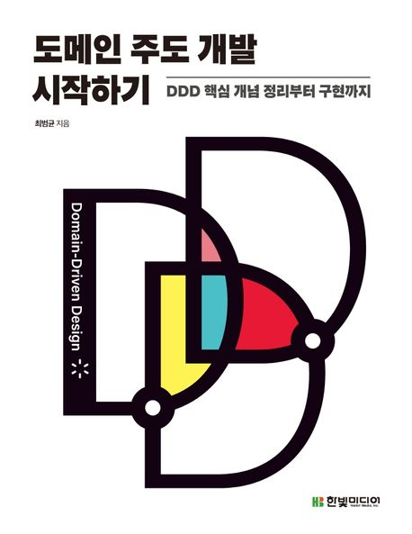

### 도메인 주도 개발 시작하기: DDD 핵심 개념 정리부터 구현까지

※ 이미지 출처: 교보문고

#### 정보
- 제목: 도메인 주도 개발 시작하기: DDD 핵심 개념 정리부터 구현까지
- 저자: 최범균
- [교보문고 바로 가기](https://product.kyobobook.co.kr/detail/S000001810495)

#### 목차
- [Chapter 1. 도메인 모델 시작하기](chapter01/README.md) 
- Chapter 2. 아키텍처 개요 
- Chapter 3. 애그리거트 
- Chapter 4. 리포지터리와 모델 구현(JPA 중심)
- Chapter 5. 스프링 데이터 JPA를 이용한 조회 기능 
- Chapter 6. 응용 서비스와 표현 영역 
- Chapter 7. 도메인 서비스 
- Chapter 8. 애그리거트 트랜잭션 관리 
- Chapter 9. 도메인 모델과 바운디드 컨텍스트 
- Chapter 10. 이벤트 
- Chapter 11. CQRS
