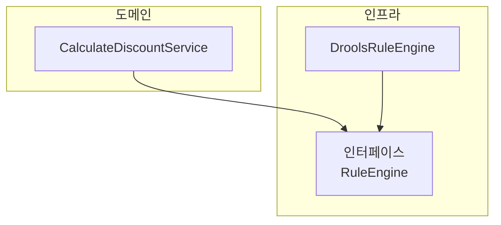
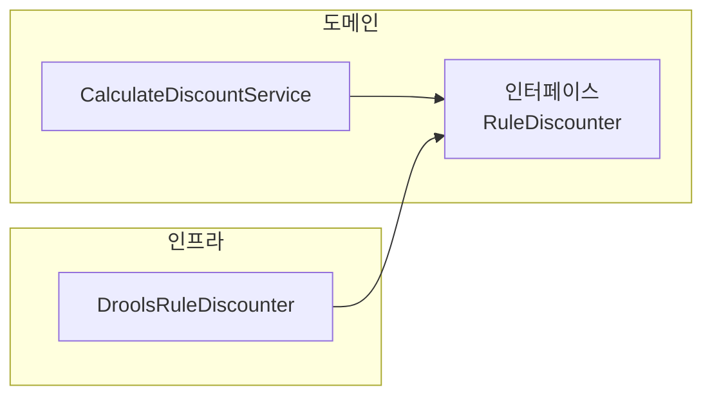
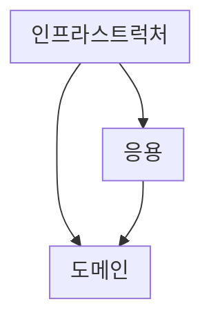

## Chapter 2. 아키텍처 개요

### 2.3 DIP

#### 2.3.1 DIP 주의사항

```markdown
DIP를 잘못 생각하면 단순히 인터페이스와 구현 클래스를 분리하는 정도로 받아들일 수 있다.
```



```markdown
위 예시는 잘못된 구조이다. 이 구조에서 도메인 영역은 구현 기술을 다루는 인프라스트럭처 영역에 의존하고 있다.
여전히 고수준 모듈이 저수준 모듈에 의존하고 있는 것이다.
...
DIP를 적용할 때 하위 기능을 추상화한 인터페이스는 고수준 모듈 관점에서 도출한다.
```



#### 2.3.2 DIP와 아키텍처

```markdown
인프라스트럭처 영역은 구현 기술을 다루는 저수준 모듈이고 응용 영역과 도메인 영역은 고수준 모듈이다.
인프라스트럭처 계층이 가장 하단에 위치하는 계층형 구조와 달리 아키텍처에 DIP를 적용하면 인프라스트럭처 영역이 응용 영역과 도메인 영역에 의존(상속)하는 구조가 된다.
```



### 2.4. 도메인 영역의 주요 구성요소

#### 2.4.2 애그리거트

```markdown
애그리거트를 사용하면 개별 객체가 아닌 관련 객체를 묶어서 객체 군집 단위로 모델을 바라볼 수 있게 된다.
...
애그리거트는 군집에 속한 객체를 관리하는 루트 엔티티를 갖는다.
루트 엔티티는 애그리거트에 속해 있는 엔티티와 밸류 객체를 이용해서 애그리거트가 구현해야 할 기능을 제공한다.
애그리거트를 사용하는 코드는 애그리거트 루트가 제공하는 기능을 실행하고 애그리거트 루트를 통해서 간접적으로 애그리거트 내의 다른 엔티티나 밸류 객체에 접근한다.
이것은 애그리거트의 내부 구현을 숨겨서 애그리거트 단위로 구현을 캡슐화할 수 있도록 돕는다.
```
