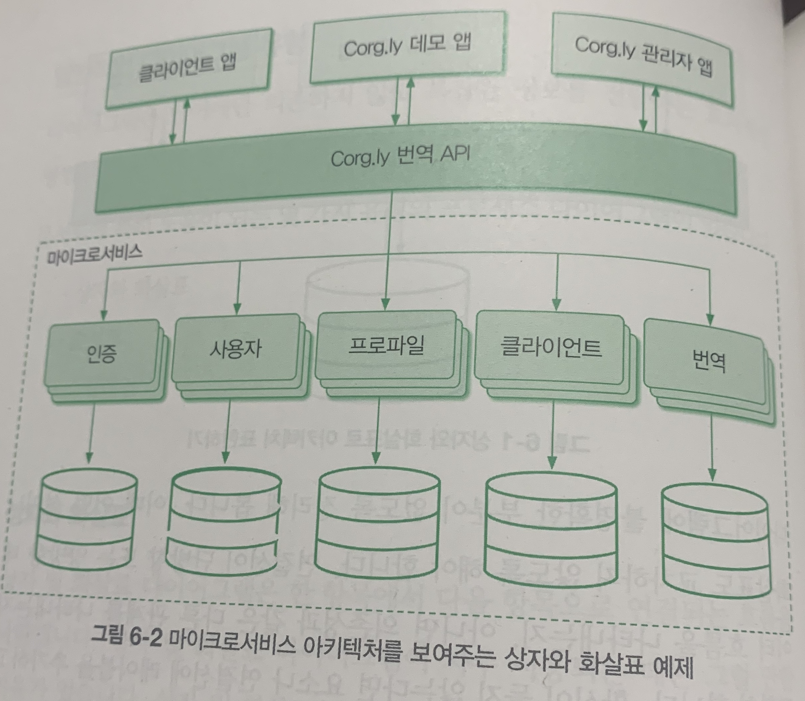
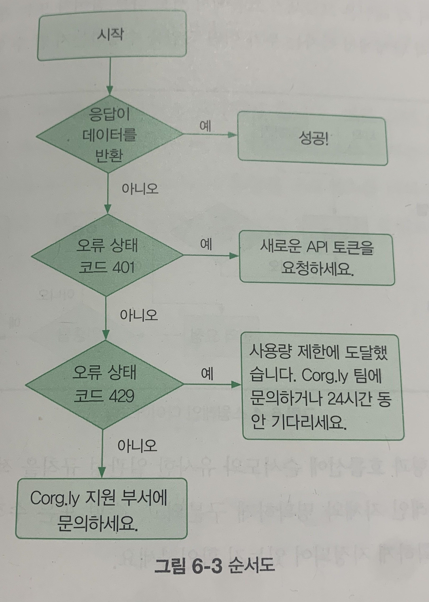
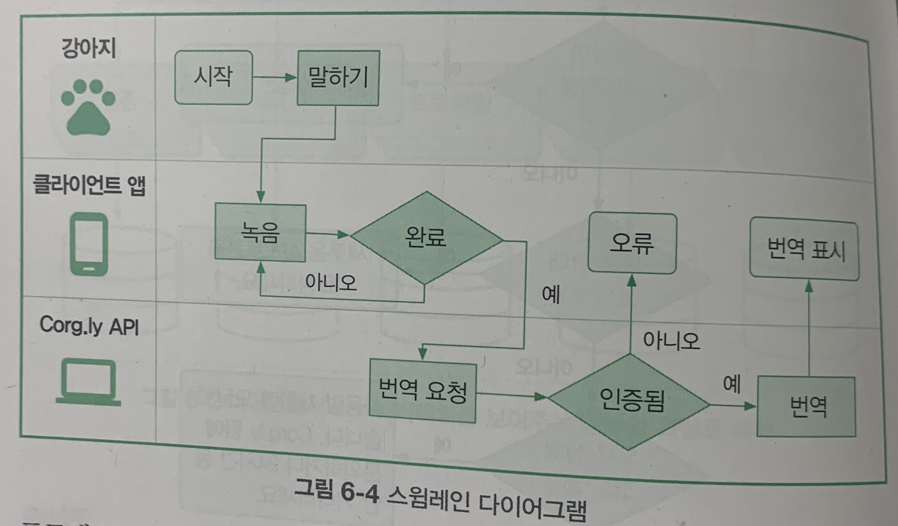

## CHAPTER 6 시각적 콘텐츠 추가하기

### 말로는 부족할 때

```markdown
'백 마디 말보다 한 장의 그림이 낫다'라는 표현을 들어본 적이 있을 것입니다.
...
어떤 이미지를 봤다가 순식간에 다른 새로운 이미지를 보더라도 여러분의 두뇌는 첫 번째 이미지를 짧은 시간 동안 처리합니다.
이미지를 하나씩 제공하면 인지 처리가 덜 필요하고, 두뇌가 연결 관계를 도출하는 데 도움이 되며, 텍스트보다 훨씬 빨리 이해를 이끌어 냅니다.
또한 우리는 정보가 이미지와 함께 제공되면 정보를 더 잘 기억합니다.
정보를 귀로 듣는 경우에는 약 10%만 기억합니다.
그러나 정보를 들을 때 이미지가 함께 나온다면 65%를 기억할 수 있습니다.
효과적인 시각적 콘텐츠는 문서화에서 위험이 높지만 보상이 큰 요소에 속합니다.
```

### 시각적 콘텐츠를 만들기 어려운 이유

```markdown
텍스트 문서와 마찬가지로, 가장 효과적인 시각적 콘텐츠는 독자에게 자연스럽게 정보를 전달합니다.
...
시각적 콘텐츠가 잘 작동하면 정보가 매우 빨리 전달되어 독자가 필요한 작업을 순식간에 훑어볼 수 있습니다.
...
하지만 시각적 콘텐츠는 텍스트 문서를 보완하는 요소이지 완전히 대체하는 것은 아닙니다.
시각적 콘텐츠의 목적은 독자의 이해를 높이는 데 도움을 주는 것이며, 그 외의 군더더기는 방해 요소가 될 수 있습니다.
...
비효율적인 시각적 콘텐츠는 정보 전달을 방해합니다.
일반적으로 다음과 같은 점이 부족하기 때문에 그렇습니다.
- 이해 용이성
- 접근성
- 성능
```

#### 이해 용이성

```markdown
닐슨 노먼 그룹이 시선 추적 기법으로 수행한 연구에 따르면 독자는 자신의 관심사와 관련된 정보가 포함된 이미지에 더 주의를 기울이며, 
다른 이미지는 아무리 아름답게 디자인되어도 무시한다고 합니다.
```

#### 접근성

```markdown
우리 모두는 명확하고 유용한 시각적 콘텐츠가 필요하지만, 비효율적인 시각적 콘텐츠는 접근성 면에서 도움이 필요한 독자를 오히려 더 어렵게 합니다.
...
아무리 좋은 의도이더라도, 텍스트로 가득 찬 다이어그램은 시각적 콘텐츠에서 이득을 봐야 하는 난독증 독자에게 오히려 도움이 되지 않을 수 있습니다.
```

#### 성능

```markdown
시각적 콘텐츠의 디자인만 주로 신경 쓰기 쉽다 보니, 콘텐츠를 만드는 사람들은 대부분 이미지나 비디오를 독자에게 어떻게 제공할지는 깊이 고려하지 않습니다.
..
문서를 프린터로 출력하여 보는 것을 고려하면 이미지 크기가 커야 하지만, 한편으로 이는 온라인에서 문서가 로딩되는 속도에 영향을 줄 수 있습니다.
화면 전체나 일부를 확대해서라도 내용을 잘 확인할 수 있을 만큼 이미지를 크고 선명하게 만드는 것이 중요하기는 하지만, 애초에 이미지를 로드하는 데 문제가 생길 정도로 커서는 안 됩니다.
```

### 스크린샷 사용하기

```markdown
스크린샷은 주로 사용자 인터페이스를 보여주는 데 도움이 됩니다.
...
스크린샷에 주석을 달아 독자가 이미지의 특정 부분에 주의를 기울이도록 하는 것도 도움이 됩니다.
블록과 화살표는 이미지의 일부를 갖오하는 데 도움이 될 수 있습니다.
다른 영역을 음영 처리하면 해당 부분의 중요성을 낮추는 데 도움이 됩니다.
...
마지막으로, IP 주소나 샘플 코드처럼 독자에게 필요할 가능성이 있는 중요한 정보를 제공할 경우에는 텍스트 없이 스크린샷만 사용하지는 마세요.
독자는 종종 이러한 정보를 직접 사용하고자 샘플 코드나 텍스트를 복사하고자 하는데, 스크린샷으로는 이런 작업이 불가능합니다.
```

### 일반적인 다이어그램 유형

```markdown
다이어그램은 단어에만 의존하지 않고 복잡한 정보를 전달하는 효과적인 방법이 될 수 있습니다.
특히 프로세스를 시각화하는 데 도움이 됩니다.
문서화에 특히 도움이 되는 몇 가지 유형의 프로세스 다이어그램이 있습니다.
- 상자와 화살표
- 순서도
- 스윔레인
```

#### 상자와 화살표

```markdown
상자 및 화살표 다이어그램은 한 항목에서 다음 항목으로 연결되는 흐름을 나타냅니다.
...
상자 및 화살표 다이어그램을 잘 사용하면 텍스트만으로는 설명하기 어려운 개체 간의 관계나 데이터 흐름을 명확하게 보여줄 수 있습니다.
```



#### 순서도

```markdown
순서도는 시작 지점부터 완료 지점까지 사용자를 안내하며 프로세스를 문서화하는 데 특히 유용합니다.
문서 초안에 프로세스가 아직 정리되어 있지 않다면 전체 프로세스를 작성해 보세요.
...
모든 다이어그램 유형과 마찬가지로 일관성을 유지하는 것이 중요합니다.
```



#### 스윔레인

```markdown
스윔레인 다이어그램은 프로세스 참여자나 특정 역할을 담당하는 개체(앱, API 등)가 여러 개 있는 상황에서 특히 유용합니다.
순서도와 유사하게 스윔레인 다이어그램은 프로세스를 시작부터 끝까지 보여 줍니다.
각 참여자나 개체는 자신만의 레인을 가지며, 프로세스의 각 단계는 해당 레인 중 하나에서 발생합니다.
이렇게 하면 누가 각 단계를 담당하는지 한 눈에 쉽게 확인할 수 있습니다.
```



### 다이어그램 그리기

```markdown
선택한 다이어그램 유형이 무엇이든 간에 단순화하는 것을 목표로 삼아야 합니다.
...
다이어그램당 하나의 아이디어만 설명해야 합니다.
예를 들면, 시스템의 추상화 수준 하나, 프로세스 흐름 한 개 또는 로직의 특정 부분 하나를 보여주세요.
..
정보를 나눠도 단순한 상태가 유지된다면 다이어그램을 여러 개 사용하는 것도 괜찮습니다.
...
정보를 덩어리나 계층으로 나누면 독자에게 적합한 디자인을 만들 수 있고, 독자의 다양한 학습 지점에서 적절한 수준의 정보를 제공할 수 있습니다.
```

#### 먼저 종이에 그려보기

```markdown
문서 작성과 마찬가지로, 효과적인 다이어그램은 좋은 계획 세우기에서 시작됩니다.
...
직접 스케치하거나 붙이는 메모지의 위치를 옮겨 보면 구성 요소를 그룹화하는 데 도움이 될 수 있으며 (종종 다루기 힘든) 디지털 도구를 본격적으로 사용하기 전에 다양한 디자인의 프로토타입을 만들어 볼 수 있습니다.
```

#### 독자를 위한 출발점 찾기

```markdown
독자가 다이어그램을 볼 때 어느 지점부터 보기를 원하는지도 고려해야 합니다.
그 출발점을 명확하게 파악할 수 있게 하고, 사용자의 읽기 패턴을 고려하세요.
```

#### 레이블 사용하기

```markdown
도형과 연결선을 깔끔하게 정리하는 것으로는 충분하지 않습니다.
레이블을 적절히 사용하면 훨씬 명확하게 표현할 수 있습니다.
...
레이블은 읽기 쉽고(조그만 텍스트는 피하세요) 이해하기 쉬워야 합니다.
```

#### 색상 일관성 있게 사용하기

```markdown
데이터베이스를 표시할 때 특정 색을 사용했다면 다이어그램의 다른 곳에서 마이크로서비스를 표시할 때는 다른 색을 사용합니다.
...
의미를 전달하기 위해서는 색상만 사용하는 대신에 레이블까지 적절히 사용하는 것이 좋습니다.
```

#### 다이어그램 배치하기

```markdown
다이어그램의 위치도 다른 사항들만큼 중요합니다.
다이어그램이 관련된 지시 사항이나 설명 근처에 나오도록 해야 합니다.
```

#### 다이어그램 게시하기

```markdown
가능하면 SVG 포맷으로 이미지를 게시합니다.
...
SVG는 확장성이 뛰어나 독자가 모든 화면 크기에서 다이어그램의 정보에 접근하고 필요 시 확대하여 볼 수 있도록 해 줍니다.
```

#### 주변의 도움 받기

```markdown
사이먼 브라운이 만든 C4 모델은 소프트웨어 아키텍처 다이어그램 작성에 특히 유용합니다.
이 모델은 추상화 수준을 시각화하는 표준화된 방법을 제공합니다.
```

### 비디오 콘텐츠 만들기

```markdown
'비디오가 소프트웨어 문서와 관련된 모든 문제의 해결책'이라고 말하는 사람은 조심해야 합니다.
좋은 비디오 콘텐츠가 효과적인 소프트웨어 문서의 일부가 될 수 없다는 말은 아닙니다.
하지만 성공한 사례보다는 아무도 찾지 않는 유튜브 채널과 십수 년 전에나 사용자에게 마지막으로 도움이 된 기능의 영상이 더 많다는 점에 유념해야 합니다.
비디오 콘텐츠는 새로운 개념을 소개할 때 유용할 수 있습니다.
...
대부분의 테크니컬 라이터는 비디오를 경계합니다.
비디오는 만들기 어렵고, 유지 관리 비용이 많이 듭니다.
...
정말로 비디오 제작에 필요한 시간과 비용을 투입하고 싶다면 전문가를 찾으세요.
...
글로 된 문서나 정적인 이미지를 변경하는 것이 비디오를 수정하는 것보다 훨씬 쉽다는 것을 기억하세요.
```

### 시각적 콘텐츠 검토하기

```markdown
아무리 단어를 적게 포함하더라도 시각적 콘텐츠도 여전히 콘텐츠입니다.
...
절대로 시각적 콘텐츠만 따로 검토하지 말고, 주변의 텍스트와 함께 확인하세요.
...
시각적 콘텐츠가 이해 용이성, 접근성, 성능 요구 사항을 충족한다는 것을 확인하면 동료들에게 보여주고 검토를 요청합니다.
디자인은 주관적이며 여러분에게 여전히 '지식의 저주'가 남아 있을 수 있다는 사실도 기억하세요.
여러분이 문서화한 내용에 지나치게 익숙하면 시각적 콘텐츠를 객관적으로 평가하기가 더 어려워집니다.
```

### 시각적 콘텐츠 유지 관리하기

```markdown
텍스트 콘텐츠도 빨리 시대에 뒤떨어질 수 있지만 시각적 콘텐츠는 훨씬 빨리 구식이 될 수 있습니다.
한 번의 UI 변경만으로 기존 스크린샷이 쓸모없게 될 수 있습니다.
프로세스가 빨리 바뀌면 다이어그램의 선 하나가 갑자기 사용자를 잘못 안내하게 될 수도 있습니다.
새로운 기능이 추가되면 높은 비용을 들여 잘 제작한 비디오를 거의 가치가 없게 만들 수도 있습니다.
이미지를 만드는 데 사용하는 포맷이나 도구에 관계없이 이미지를 쉽게 업데이트할 수 있도록 원본 파일을 다른 사람과 공유해야 합니다.
```
