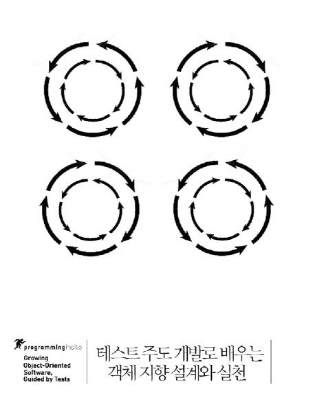

##### 테스트 주도 개발로 배우는 객체 지향 설계와 실천

※ 이미지 출처: 교보문고

#### 정보
- 제목: 테스트 주도 개발로 배우는 객체 지향 설계와 실천
- 저자: 스티브 프리먼, 냇 프라이스
- [교보문고 바로 가기](https://product.kyobobook.co.kr/detail/S000001032969)

#### 목차
- 1부 서론 
  - 1장 테스트 주도 개발의 핵심은 무엇인가?
  - 2장 객체를 활용한 테스트 주도 개발
  - 3장 도구 소개
- 2부 테스트 주도 개발 과정 
  - 4장 테스트 주도 주기 시작
  - 5장 테스트 주도 개발 주기의 유지
  - 6장 객체 지향 스타일
  - 7장 객체 지향 설계의 달성
  - 8장 서드 파티 코드를 기반으로 한 개발
- 3부 동작하는 예제
  - 9장 경매 스나이퍼 개발 의뢰
  - 10장 동작하는 골격
  - 11장 첫 테스트 통과하기
  - 12장 입찰 준비
  - 13장 스나이퍼가 입찰하다
  - 14장 스나이퍼가 경매에서 낙찰하다
  - 15장 실제 사용자 인터페이스를 향해
  - 16장 여러 품목에 대한 스나이핑
  - 17장 Main 분석
  - 18장 세부 사항 처리
  - 19장 실패 처리
- 4부 지속 가능한 테스트 주도 개발
  - 20장 테스트에 귀 기울이기
  - 21장 테스트 가독성
  - 22장 복잡한 테스트 데이터 만들기
  - 23장 테스트 진단
  - 24장 테스트 유연성
- 5부 고급 주제
  - 25장 영속성 테스트
  - 26장 단위 테스트와 스레드
  - 27장 비동기 코드 테스트
- 후기 목 객체의 간략한 역사
- 부록 A jMock2 정리 노트
- 부록 B 햄크레스트 매처 작성
