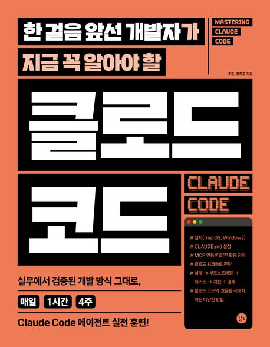

### 한 걸음 앞선 개발자가 지금 꼭 알아야 할 클로드 코드

※ 이미지 출처: 교보문고

#### 정보
- 제목: 한 걸음 앞선 개발자가 지금 꼭 알아야 할 클로드 코드
- 저자: 조훈, 정찬훈
- [교보문고 바로 가기](https://product.kyobobook.co.kr/detail/S000217402731)
- [예제 코드](https://github.com/sysnet4admin/_Book_Claude-Code)

#### 목차
- 1주차: 클로드 코드 시작하기
  - 월 | 클로드 코드 설치하기
  - 화 | 클로드 코드에서 제공하는 내장 명령어
  - 수 | 인공지능으로 내 컴퓨터에만 있는 정보 분석하기
  - 목 | 넘겨받은 디렉터리 분석 및 조치
  - 금 | 고양이 웹 페이지를 만들고 공개하기
- 2주차: 클로드 코드 설정하기 
  - 월 | CLAUDE.md
  - 화 | 프롬프트 잘 작성하기
  - 수 | 클로드 실행 모드 마스터하기
  - 목 | 클로드 코드의 내장 도구와 터미널 확장
  - 금 | MCP(Model Context Protocol) 연동
- 3주차: 클로드 워크플로 전략 
  - 월 | 프로젝트 설계
  - 화 | 부트스트래핑: 프로젝트 초기 구성 자동화
  - 수 | 테스트: 클로드 코드와 함께하는 TDD
  - 목 | 개선: 코드 리뷰, 리팩토링, 성능 최적화
  - 금 | 명세 작성 및 문서화: 살아 있는 문서 만들기
- 4주차: 클로드 코드 효율 극대화하기
  - 월 | LLM 엔진 최적화와 컨텍스트 관리
  - 화 | 사용자 정의 명령어 만들기
  - 수 | 클로드 코드 확장하기
  - 목 | 다양한 MCP 활용 전략
  - 금 | 멀티에이전트 시스템
