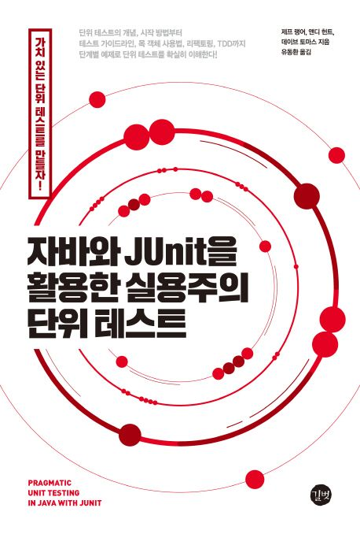

### 자바와 JUnit을 활용한 실용주의 단위 테스트

※ 이미지 출처: 교보문고

#### 정보
- 제목: 자바와 JUnit을 활용한 실용주의 단위 테스트
- 저자: 제프 랭어, 앤디 헌트, 데이브 토마스
- [교보문고 바로 가기](https://product.kyobobook.co.kr/detail/S000001792858)

#### 목차
- 1부 단위 테스트의 기초 
  - 1장 첫 번째 JUnit 테스트 만들기 
  - 2장 JUnit 진짜로 써 보기 
  - 3장 JUnit 단언 깊게 파기
  - [4장 테스트 조직](chapter04/README.md)
- 2부 빠른 암기법 습득 
  - [5장 좋은 테스트의 FIRST 속성](chapter05/README.md) 
  - [6장 Right-BICEP: 무엇을 테스트할 것인가?](chapter06/README.md) 
  - [7장 경계 조건: CORRECT 기억법](chapter07/README.md) 
- 3부 더 큰 설계 그림 
  - [8장 깔끔한 코드로 리팩토링하기](chapter08/README.md) 
  - [9장 더 큰 설계 문제](chapter09/README.md) 
  - 10장 목 객체 사용 
  - 11장 테스트 리팩토링 
- 4부 더 큰 단위 테스트 그림 
  - 12장 테스트 주도 개발 
  - 13장 까다로운 테스트 
  - 14장 프로젝트에서 테스트 
- 부록 A 인텔리제이 IDEA와 넷빈즈에서 JUnit 설정
