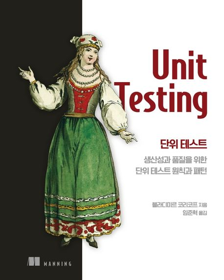

### 단위 테스트

※ 이미지 출처: 교보문고

#### 정보
- 제목: 단위 테스트
- 저자: 블라디미르 코리코프
- [교보문고 바로 가기](https://product.kyobobook.co.kr/detail/S000001805070)

#### 목차
- 1부. 더 큰 그림
  - [1장. 단위 테스트 목표](chapter01/README.md)
  - [2장. 단위 테스트란 무엇인가](chapter02/README.md)
  - [3장. 단위 테스트 구조](chapter03/README.md)
- 2부. 개발자에게 도움이 되는 테스트 만들기
  - [4장. 좋은 단위 테스트의 4대 요소](chapter04/README.md)
  - [5장. 목과 테스트 취약성](chapter05/README.md)
  - [6장. 단위 테스트 스타일](chapter06/README.md)
  - [7장. 가치 있는 단위 테스트를 위한 리팩터링](chapter07/README.md)
- 3부. 통합 테스트
  - [8장. 통합 테스트를 하는 이유](chapter08/README.md)
  - 9장. 목 처리에 대한 모범 사례
  - 10장. 데이터베이스 테스트
- 4부. 단위 테스트 안티 패턴
  - 11장. 단위 테스트 안티 패턴
