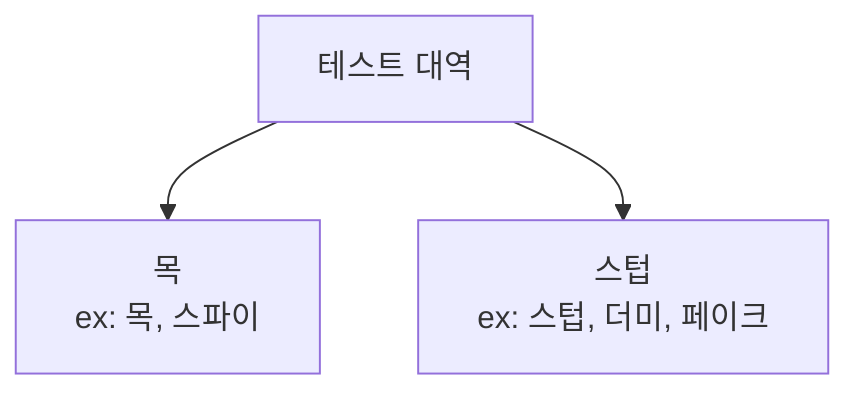

## 5장. 목과 테스트 취약성

### 5.1 목과 스텁 구분

#### 5.1.1 테스트 대역 유형

```markdown
텟트 대역은 모든 유형의 비운영용 가짜 의존성을 설명하는 포괄적인 용어다.
...
제라드 메스자로스에 따르면, 테스트 대역에는 더미, 스텁, 스파이, 목, 페이크라는 다섯 가지가 있다.
...
실제로는 목과 스텁의 두 가지 유형으로 나눌 수 있다.
```

```markdown
- 목은 외부로 나가는 상호 작용을 모방하고 검사하는 데 도움이 된다. 이러한 상호 작용은 SUT가 상태를 변경하기 위한 의존성을 호출하는 것에 해당한다.
- 스텁은 내부로 들어오는 상호 작용을 모방하는 데 도움이 된다. 이러한 상호 작용은 SUT가 입력 데이터를 얻기 위한 의존성을 호출하는 것에 해당한다.
...
목은 SUT와 관련 의존성 간의 상호 작용을 모방하고 검사하는 반면, 스텁은 모방만 한다.
이는 중요한 차이점이다.
```

#### 5.1.3 스텁으로 상호 작용을 검증하지 말라

```markdown
5.1.1절에서 언급했듯이 목은 SUT에서 관련 의존성으로 나가는 상호 작용을 모방하고 검사하는 반면,
스텁은 내부로 들어오는 상호 작용만 모방하고 검사하지 않는다.
이 두가지의 차이는 스텁과의 상호 작용을 검증하지 말라는 지침에서 비롯된다.
SUT에서 스텁으로의 호출은 SUT가 생성하는 최종 결과가 아니다.
이러한 호출은 최종 결과를 산출하기 위한 수단일 뿐이다.
즉, 스텁은 SUT가 출력을 생성하도록 입력을 제공한다.
...
최종 결과가 아닌 사항을 검증하는 이러한 관행을 과잉 명세(overspecification)라고 부른다.
```

`참고: 스텁과의 상호 작용을 검증하는 것은 취약한 테스트를 야기하는 일반적인 안티 패턴이다.`

#### 5.1.5 목과 스텁은 명령과 조회에 어떻게 관련돼 있는가?

```markdown
목과 스텁의 개념은 명령 조회 분리(CQS, Command Query Separation) 원칙과 관련이 있다.
...
명령을 대체하는 테스트 대역은 목이다.
마찬가지로 조회를 대체하는 테스트 대역은 스텁이다.
```

