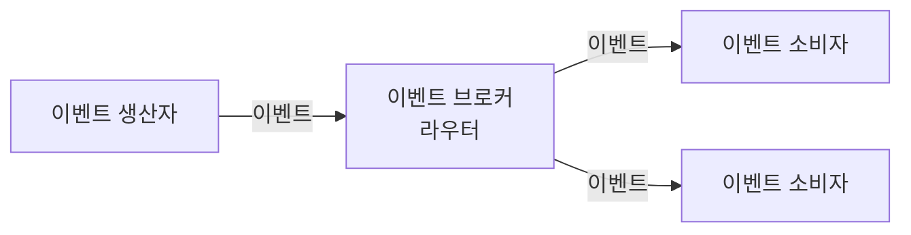

## 11장 자주 쓰는 서버 구조와 설계 패턴

### MVC 패턴
- 자바의 스프링 프레임워크와 Node.js의 Express.js가 전형적인 MVC 패턴을 사용한다.


### 계층형 아키텍처
- 계층형 아키텍처(Layered Architecture)는 각 계층마다 특정 역할을 수행하고, 하위에 위치한 계층에만 의존하는 특징을 갖는다.


### 흩어지는 도메인 로직
- 단순히 서비스/DAO로 구성된 계층형 아키텍처를 사용하면 실제로 계층은 3개가 된다.
- 도메인 영역이 (거의) 없는 계층 구조에서는 도메인 로직이 인프라와 응용 계층으로 분산되는 경향이 있어 코드 유지보수를 어렵게 만들기도 한다.

- 다음 쿼리는 쿼리에 도메인 로직이 스며들어간 전형적인 예를 보여준다
```sql
-- MemberDao.updateMemberStatus(id) 쿼리
UPDATE member
SET status = 20
WHERE member_id = ?
AND status = 10;
```

- 이 쿼리는 status가 10인 경우에 status를 20으로 변경하는 쿼리이다.
- 이 쿼리를 실행하는 코드는 다음과 같은 형태를 갖는다.

```java
int cnt = mdao.updateMemberStatus(id);
if (cnt == 0) {
    // 변경 건이 없으므로 변경 실패 처리
}
```

- 이 코드에는 어떤 도메인 로직도 없다. 단지 회원의 상태를 변경하는 DAO 메서드를 실행하고 결과 건수가 0이면 변경 실패 처리를 한다.
- 어떤 조건일 때 상태가 변경되는지 확인하려면 쿼리를 뒤져야 한다.
- 이것이 도메인 모델이 빈약하거나 없을 때 발생하는 로직 흩어짐 증상이다.
- 이렇게 도메인 로직이 쿼리나 컨트롤러와 같은 다른 계층에 흩어지는 것을 방지하려면 도메인 로직을 최대한 한계층으로 모아야 한다.


### DDD와 전술 패턴
- DDD에서 도메인 모델의 구성 요소

| 구성 요소                        | 설명                                                                                                                                                  |
|------------------------------|-----------------------------------------------------------------------------------------------------------------------------------------------------|
| 엔티티<br/>(Entity)             | 각 엔티티 객체는 고유의 식별자를 가지며, 각 엔티티는 식별자로 구분된다. 내부 상태가 바뀌어도 식별자는 바뀌지 않는다.<br/>예를 들어 각 주문 엔티티는 서로 다른 주문번호를 식별자로 갖는다.                                       |
| 밸류<br/>(Value)               | 밸류는 고유의 식별자를 갖지 않으며 개념적인 값을 표현한다.<br/>금액, 배송, 주소 같은 값이 밸류가 된다. 값은 불변으로 구현하는 것을 추천한다.                                                                |
| 애그리거트<br/>(Aggregate)        | 애그리거트는 관련된 객체를 묶어 하나의 개념적인 단위를 표현한다.<br/>예를 들어 주문 애그리거트는 Order 엔티티, OrderLine 밸류 집합, ShippingAddress 밸류로 구성될 수 있다.<br/>애그리거트는 모델의 일관성을 관리하는 단위가 된다. |
| 리포지토리<br/>(Repository)       | 도메인 객체를 물리적인 저장소와 연결할 때 사용하는 모델이 리포지토리이다.<br/>리포지토리는 도메인 객체를 저장하고 조회할 때 사용되는 인터페이스를 제공한다. 리포지토리는 애그리거트 단위로 존재한다.                                    |
| 도메인 서비스<br/>(Domain Service) | 특정한 애그리거트에 속하지 않은 로직을 구현한다. 외부 연동이 필요한 도메인 로직도 도메인 서비스로 사용해서 표현한다.                                                                                  |
| 도메인 이벤트<br/>(Domain Event)   | 도메인 내에서 발생한 이벤트를 표현한다. 도메인의 상태가 변경될 때 도메인 이벤트가 발생한다. 도메인 이벤트는 주로 다른 부분에 변화를 알리기 위해 사용된다.                                                            |


- DDD는 위 구성 요소를 사용해서 도메인 로직을 애그리거트 단위로 묶는다.
- 복잡한 모델을 애그리거트 단위로 관리할 수 있게 함으로써 복잡도를 낮추고, 애그리거트 관련 로직을 모아 응집도를 높인다.
- 이는 복잡한 도메인의 유지보수성을 높여준다.
- 전술 패턴 외에도 바운디드 컨텍스트(bounded-context)는 도메인 간의 경계를 설정해준다.


### 마이크로서비스 아키텍처
- 마이크로서비스는 모놀리식 아키텍처와 장단점을 비교하고, 효과가 분명할 때 도입해야 한다.

|    | 모놀리식                                                                                                              | 마이크로서비스                                                                                                           |
|----|-------------------------------------------------------------------------------------------------------------------|-------------------------------------------------------------------------------------------------------------------|
| 장점 | - 배포가 단순하다.<br/>- 코드 관리가 쉽다.<br/>- 성능을 높이기 위해 복잡한 구조를 가질 필요가 없다.<br/>- 테스트와 디버깅이 쉽다.                              | -독립적인 배포와 지속적인 배포가 용이하다.<br/>- 성능 확장이 용이하다.<br/>- 기술에 대한 유연성을 가질 수 있다.<br/>- (보통) 개발자의 만족도가 더 높다.                 |
| 단점 | - 규모가 커질수록 개발 속도가 느려질 수 있다.<br/>- 한 기능의 문제가 전체에 영향을 줄 수 있다.<br/>- 구현 기술 변경에 어려움이 있다.<br/>- 작은 변경도 전체를 다시 배포해야 한다. | - 테스트와 디버깅이 어려울 수 있다.<br/>- 모놀리식 대비 인프라가 복잡해진다.<br/>- 소통에 따른 부하가 증가할 수 있다.<br/>- 무분별하게 서비스를 만들면 분산 모놀리식이 도리 수 있다. |


- 마이크로서비스 6가지 핵심 개념
  - 독립적 배포
    - 다른 마이크로서비스를 배포하지 않고도 마이크로서비스를 변경, 배포, 출시할 수 있어야 한다.
  - 도메인을 중심으로 모델링
    - 각 마이크로서비스는 도메인을 기준으로 구분해야 한다. 한 도메인의 기능 구현이 여러 마이크로서비스에 걸쳐 있으면 출시 비용이 증가한다.
  - 자신의 상태를 가짐
    - 마이크로서비스는 DB를 공유하지 않는다. 다른 마이크로서비스의 데이터를 사용할 경우 DB에 직접 접근하지 않고 API 등을 통해 접근한다.
  - 크기
    - 마이크로서비스의 크기에 절대적인 기준은 없다. 마이크로서비스의 크기를 정할 때는 조직이 감당할 수 있는 수준과 마이크로서비스 경계 정의에 집중해야 한다.
  - 유연함
    - 마이크로서비스는 비용을 들여 기술, 확장, 견고함과 같은 유연함을 얻는 구조다. 비용을 감당할 수 있는 수준에서 도입을 고려해야 한다.
  - 아키텍처와 조직을 맞춤
    - 조직 구조는 아키텍처에 영향을 준다. 비즈니스 도메인이 시스템 아키텍처를 주도하는 주요 원동력이 되도록 설계한다.
    - `시스템 구조는 시스템을 설계하는 조직의 소통 구조를 닮는다.는 콘웨이 법칙이 있다.`


### 이벤트 기반 아키텍처 (Event-Driven Architecture)
- 이벤트 기반 아키텍처는 두 시스템 간에 통신할 때 이벤트를 사용하는 구조다.
- 이벤트 기반 아키텍처는 다음의 3가지 구성 요소로 이루어진다.
  - 이벤트 생산자
  - 이벤트 소비자
  - 이벤트 브로커(또는 라우터)


- 이벤트 기반 아키텍처의 장점 중 하나는 생산자와 소비자가 직접 연결되지 않고 브로커를 통해 간접적으로 연결된다는 점이다.
- 덕분에 서로 간섭하지 않고 독립적으로 배포할 수 있으며, 새로운 소비자 추가도 용이하다.


### CQRS 패턴
- 아주 단순한 시스템은 상태 변경과 상태 조회가 동일한 모습을 갖지만, 조금만 복잡해져도 상태 변경에 사용하는 데이터와 상태 조회 시 사용하는 데이터에 차이가 발생한다.
- 명령과 조회에서 사용하는 데이터가 서로 다른 것이다.
- 명령과 조회가 서로 다른 데이터를 사용하는데도 하나의 모델로 명령과 조회를 모두 구현하면, 모델이 복잡해지고 코드 유지보수가 어려워진다.
- 도메인이 복잡해질 경우에는 CQRS 패턴을 사용해서 단일 모델 사용으로 인해 발생하는 복잡도 문제를 해결할 수 있다.
- CQRS는 Command Query Responsibility Segregation의 약자로, 명령을 위한 모델과 조회를 위한 모델을 분리하는 패턴이다.
- CQRS는 명령 모델과 조회 모델을 구분하므로 각 기능에 맞게 모델을 구현할 수 있다는 이점이 있다.
- 추가로 조회 모델이 별도로 존재하므로 조회 성능을 향상시키기 쉽다.
  - 조회 모델에 캐시를 적용하거나, 조회 전용 DB를 확장하는 방식이 이에 해당한다.
- 단점은
  - 각 기능마다 모델을 따로 만들어야 하므로 작업해야 할 코드가 늘어난다. 따라서 추가되는 코드 대비 얻는 이점이 더 큰지 따져봐야 한다.
  - 구현 기술이 늘어날 수 있다.
    - 명령 모델과 조회 모델을 서로 다른 기술로 구현할 때도 많은데, 이 경우에는 서로 다른 DB 간의 데이터 동기화를 위해 추가적인 메시징 수단을 도입해야 한다.

