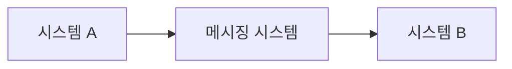
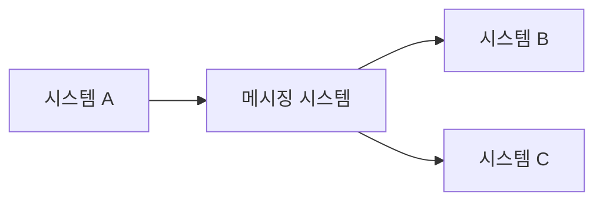
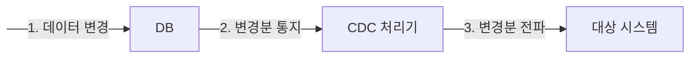
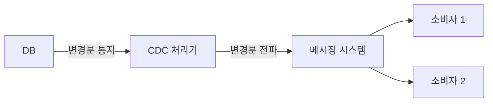
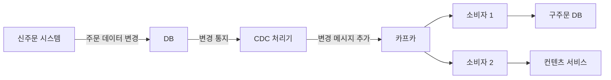

## 5장 비동기 연동, 언제 어떻게 써야 할까

## 동기 연동과 비동기 연동
- 동기 방식이 외부 연동을 만나면 고려할 게 있다.
- 연동하는 외부 서비스의 응답 시간을 고려해야 한다.
- 외부 서비스의 응답 시간이 길면 동기 방식으로 연동하는 것은 적절하지 않다.
- 심한 경우 외부 연동 서비스로 인해 전체 서비스가 먹통이 되기도 한다.
- 작업을 위해 반드시 외부 연동 결과가 필요한게 아니라면 동기 방식 대신 비동기 방식으로 연동하는 것을 고려해볼 필요가 있다.


### 비동기 방식을 사용해도 되는 유형의 특징
- 연동에 약간의 시차가 생겨도 문제가 되지 않는다.
- 일부 기능은 실패했을 때 재시도가 가능하다.
- 연동에 실패했을 때 나중에 수동으로 처리할 수 있는 기능도 있다.
- 연동에 실패했을 때 무시해도 되는 기능도 있다.


### 비동기 연동 방식
- 별도 스레드로 실행하기
- 메시징 시스템 이용하기
- 트랜잭션 아웃박스 패턴 사용하기
- 배치로 연동하기
- CDC 이용하기


### 별도 스레드로 실행하기
- 새로운 스레드를 생성하여 연동하거나 스레드 풀을 사용하여 연동할 수 있다.
- 또는 스프링에서 제공하는 `@Async` 어노테이션을 사용하여 비동기 메서드를 만들 수도 있다.
```java
// new Thread
public OrderResult placeOrder(OrdeRequest req) {
    // 주문 생성 처리
    
    // 스레드를 생성해서 푸시를 비동기로 발송
    new Thread(() -> pushClient.sendPush(pushData)).start();
    
    return successResult(...); // 푸시 발송을 기다리지 않고 리턴
}

// 스레드 풀
ExecutorService executor = Executors.newFixedThreadPool(50);

public OrderResult placeOrder(OrderRequest req) {
    // 주문 생성 처리
    
    // 스레드 풀을 이용해 푸시를 비동기로 발송
    executor.submit(() -> pushClient.sendPush(pushData));
    
    return successResult(...); // 푸시 발송을 기다리지 않고 리턴
}

// @Async 어노테이션
@Async
public void sendPushAsync(PushData pushData) {
    pushClient.sendPush(pushData);
    // 기타 코드
}
```
- 별도 스레드로 실행하면 연동 과정에서 발생한 오류 처리에 더 신경 써야 한다.
- 익셉션을 전파해도 소용없기 때문이다.
- 별도 스레드로 실행되는 코드는 내부에서 연동 과정에서 발생한 오류를 직접 처리해야 한다.


## 메시징

- 메시징 시스템을 사용하면서 구조가 더 복잡해졌지만, 구조가 복잡해지는 대신 다른 이점을 얻을 수 있다.
- 두 시스템이 서로 영향을 주지 않는다.
  - 시스템 B가 느려지더라도 시스템 A는 영향을 받지 않는다.
- 확장이 용이하다.
  - 신규 시스템 C가 추가되더라도 시스템 A와 B는 변경할 필요가 없다.


### 메시지 생성 측 고려 사항
- 메시지를 생성할 떄 고려할 점은 메시지 유실에 대한 것이다.
- 메시지 전송 과정에서 타임아웃이 발생할 수 있는데, 생산자와 메시징 시스템 간의 네트워크 연결이 불안정하면 언제든 발생할 수 있다.
- 이 때 오류 처리를 위해 선택할 수 있는 방법은 다음 3가지가 있다.
  - 무시 (ignore)
  - 재시도 (retry)
  - 실패 로그 (continue)

- 무시 (ignore)
  - 오류를 무시하는 경우이며 이 경우 메시지는 유실된다.
  - 메시지 용도에 따라 유실이 일부 허용될 수 있다.
- 재시도 (retry)
  - 메시지 전송에 실패했을 때 재시도하는 방법이다.
  - 하지만 메시지 전송을 재시도하는 과정에서 중복된 메시지가 전송될 수 있다.
  - 메시징 시스템이 중복 수신을 방지하는 기능을 제공하지 않으면 메시지 소비자가 중복 메시지를 알맞게 처리해야 한다.
  - 메시지마다 고유 식별자를 사용하면 메시지 소비자가 중복 메시지 여부를 판단하는 데 도움이 된다.
- 실패 로그 (continue)
  - 메시지 전송에 실패했을 때는 로그를 남기는 방법이다.
  - 로그는 나중에 후처리를 하는 데 사용되며, 로그는 DB에 저장하거나 파일에 남길 수도 있다.
  - 실패 로그는 후처리에 대한 데이터를 담고 있어야 한다.


- 메시지 생산자는 DB 트랜잭션과의 연동도 고려해야 한다. DB 트랜잭션에 실패했는데 메시지가 발송되면 잘못된 데이터가 전달될 수 있기 때문이다.


### 메시지 소비 측 고려 사항
- 메시지 소비자는 다음 2가지 이유로 동일 메시지를 중복해서 처리할 수 있다.
  - 메시지 생산자가 같은 데이터를 가진 메시지를 메시징 시스템에 두 번 전송
  - 소비자가 메시지를 처리하는 과정에서 오류가 발생해서 메시지 재수신


- 메시지 재수신이 가능한 경우 소비자가 메시지를 처리하는 과정에서 오류가 발생하면 재처리를 위해 메시지를 다시 수신할 수 있다.
- 메시지 재수신에 따른 중복 처리를 대응하는 방법은 멱등성을 갖도록 API를 구현하는 것이다.
- 중복 메시지 처리와 함께 메시지 소비자를 구현할 때 고려할 점은 메시지를 잘 소비하고 있는지 모니터링하는 것이다.


### 메시지 종류: 이벤트와 커맨드
- 이벤트는 어떤 일이 발생했음을 알려주는 메시지다.
- 커맨드는 무언가를 요청하는 메시지다.
- 커맨드 메시지를 수신하는 소비자는 메시지로 요구한 기능을 실행한다.
- 커맨드 메시지는 메시지를 수신할 측의 기능 실행에 초점이 맞춰져 있다. 즉, 수신자가 정해져 있다.
- 반면에 이벤트 메시지는 정해진 수신자가 없다. 발생한 사건에 관심이 있는 소비자가 메시지를 수신하는 방식이다.
- 이벤트 메시지는 소비자 확장에 적합하다.

| 이벤트        | 커맨드           |
|------------|---------------|
| 주문함        | 포인트 지급하기      |
| 로그인에 실패함   | 로그인 차단하기      |
| 상품 정보를 조회함 | 배송 완료 문자 발송하기 |
| 배송을 완료함    |               |


### 트랜잭션 아웃박스 패턴
- 메시지 데이터 자체가 유실되지 않도록 보장하는 방법은 먼저 해당 데이터를 DB에 안전하게 저장해두는 것이다.
- 그 뒤 저장된 메시지를 읽어 메시징 시스템에 전송하면 된다.
- 트랜잭션 아웃박스 패턴은 하나의 DB 트랜잭션 내에서 다음 2가지 작업을 수행한다.
  - 실제 업무 로직에 필요한 DB 변경 작업을 수행한다.
  - 메시지 데이터를 아웃박스 테이블에 추가한다.
- 아웃박스 테이블에 쌓인 메시지 데이터는 별도의 메시지 중계 프로세스가 주기적으로 읽어서 메시징 시스템에 전송한다.
- DB 트랜잭션 범위에서 아웃박스 테이블에 메시지 데이터를 추가하므로 메시지 데이터가 유실되지 않는다.
- 트랜잭션을 롤백하면 메시지 데이터도 함께 롤백되므로 잘못된 메시지 데이터가 전송될 일도 없다.
```java
public void processMessages() {
    // 아웃박스 테이블에서 대기 메시지 데이터를 순서대로 조회함
  List<MessageData> waitMessages = selectWaitingMessages();
  
  for (MessageData message : waitMessages) {
    try {
        // 메시징 시스템에 메시지 전송
        sendMessage(message);
        
        // 발송 완료 표시
        markDone(m.getId());
    } catch (Exception e) {
        // 메시지 발송에 실패한 경우 후속 처리함
        handleError(e);
        break; // 순서대로 발송하기 위해 에러가 났을 때 멈춤
    }
  }
}
```

- 발송 완료를 표시하는 방법은 2가지가 있다.
  - 아웃박스 테이블에 발송 상태 컬럼을 두는 것
    - 발송 대기, 발송 완료, 발송 실패 상태를 갖는다.
  - 메시지 중계 서비스가 성공적으로 전송한 마지막 메시지 ID를 별도로 기록하는 것
    - 파일, 별도의 테이블에 메시지 ID를 저장해두고 다음번 대기 메시지를 조회할 때 해당 ID 이후의 메시지만 조회한다.
    - 2개 이상의 메시지 중계 서비스가 하나의 아웃박스 테이블을 함께 사용하는 환경이라면 각 중계 서비스가 고유하게 마지막 메시지
    - ID를 관리해야 하므로, 이 경우에는 마지막 메시지 ID를 기록하는 방식이 더 적합할 수 있다.


### 아웃박스 테이블 구조
- 기본 구조는 다음과 같으며 상황에 맞게 변경해서 사용하면 된다.

| 컬럼          | 타입        | 설명                                                                     |
|-------------|-----------|------------------------------------------------------------------------|
| id          | big int   | 단순 증가 값(PK), 저장된 순서대로 증가하는 값을 사용한다.                                    |
| messageId   | varchar   | 메시지 고유 ID(고유키)                                                         |
| messageType | varchar   | 메시지 타입                                                                 |
| payload     | clob      | 메시지 데이터                                                                |
| status      | varchar   | 이벤트 처리 상태로 다음 세 값을 가진다.<br/>-WAITING: 대기<br/>-DONE: 완료<br/>-FAILED: 실패 |
| failCount   | int       | 실패 횟수                                                                  |
| occuredAt   | timestamp | 메시지 발생 시간                                                              |
| processedAt | timestamp | 메시지 처리 시간                                                              |
| failedAt    | timestamp | 메시지 처리 실패 시간                                                           |


### 배치 전송
- 배치 전송은 데이터를 비동기로 연동하는 가장 전통적인 방법이라고 할 수 있다.
- 메시징 시스템이 거의 실시간으로 데이터를 연동한다면, 배치는 일정 간격으로 데이터를 전송한다.


- 배치로 전송하는 전형적인 실행 과정은 다음과 같다.
  - DB에서 전송할 데이터를 조회한다.
  - 조회한 결과를 파일로 기록한다.
  - 파일을 연동 시스템에 전송한다.


### 재처리 기능 만들기
- 어떤 이유에서든 전송에 실패하면 일정 시간 후에 재전송하는 기능을 구현해 두자
- 한 두번 정도만 재시도해도 수작업으로 재처리하는 번거로움을 상당히 줄일 수 있다.
- 재시도를 했음에도 실패하는 경우가 있다.
- 이럴 때를 대비해서 수동으로 배치를 쉽게 실행할 수 있도록 명령어나 API를 만들어 두자.
- 문제가 생겼을 때 빠르고 편하게 배치를 재실행할 수 있다.


### CDC (Change Data Capture)
```markdown
변경된 데이터를 추적하고 판별해서 변경된 데이터로 작업을 수행할 수 있도록 하는 소프트웨어 설계 패턴 - 위키피디아
```

- 오라클이나 MySQL 같은 DBMS는 데이터가 변경되면 그 변경 내용을 통지하는 기능을 제공한다. CDC는 이 기능을 활용해서 구현한다.



- 변경 데이터는 레코드 단위로 전달된다.
  - ex: 1개 레코드를 추가하고 2개 레코드를 수정한 다음 3개 레코드를 삭제했다면 총 6개 레코드에 대한 변경분이 CDC 처리기에 전달된다.
- 이 변경분 데이터는 추가/수정/삭제인지 구분할 수 있는 플래그를 갖는다.
  - 수정의 경우 변경된 컬럼의 이전/이후 값이 포함되어 있어 어떤 컬럼이 어떻게 변경되었는지 확인할 수 있다.
- CDC 처리기는 전달받은 변경 데이터를 확인하고 가공한 뒤에 대상 시스템에 전파한다.
- 이 CDC 처리기는 크게 2가지 형태로 대상 시스템에 변경 데이터를 전파한다.
  - 변경 데이터를 그대로 대상 시스템에 전파
  - 변경 데이터를 가공/변환해서 대상 시스템에 전파



```markdown
CDC와 이벤트

CDC는 데이터의 변경 분을 전달한다.
이는 어떤 일이 발생했음을 알려주는 이벤트 메시지에 가깝다.
하지만 이벤트처럼 정확하게 의미를 전달하지는 못한다.
데이터의 변경 분을 통해서 의미를 도출할 수 있을 뿐이다.
```


### CDC와 데이터 위치
- CDC 처리기는 변경 데이터를 어디까지 처리했는지 기록해야 한다.
- 예를 들어 MySQL은 바이너리 로그를 이용해서 CDC를 구현하는데, 각 로그 항목은 변경된 데이터와 로그 파일에서의 위치(포지션) 값을 갖는다.
- 이 위치를 기록해야 CDC 처리기를 재시작할 때 마지막으로 조회한 로그부터 읽어올 수 있다.
- 이 위치를 기록하지 않으면 마지막 로그 데이터부터 읽어와야 하는데, 이 경우 CDC 처리기를 재시작하는 시간 동안 발생한 변경 데이터를 놓치게 된다.


### CDC가 유용할 때
- 시스템이 복잡해서 연동 코드를 넣기 부담스러울 때 CDC를 유용하게 활용할 수 있었다. (필자의 경험)



