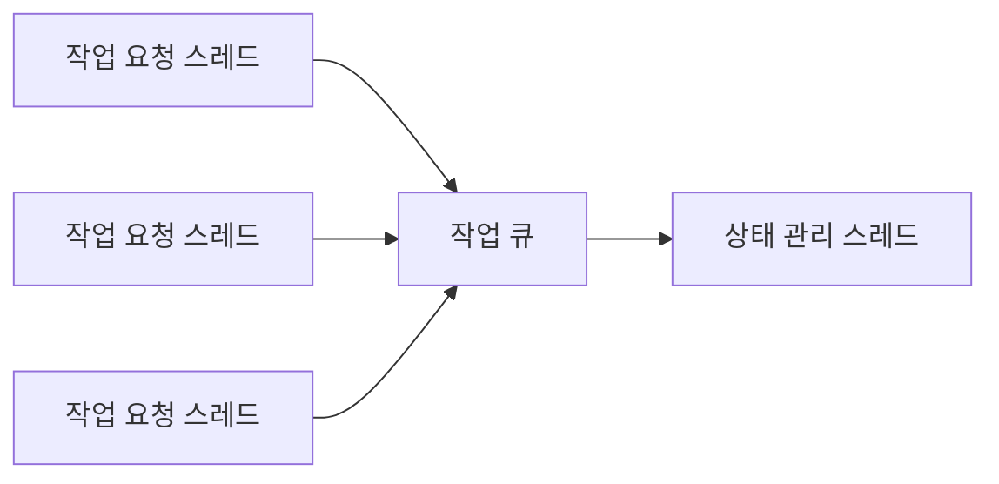

## 6장 동시성, 데이터가 꼬이기 전에 잡아야 한다

### 서버와 동시 실행
- 동시에 여러 클라이언트가 요청을 보내기 때문에, 서버는 각 요청을 동시에 처리해야 한다.
- 만약 동시에 처리하지 못하고 각 요청을 순차적으로 처리한다면 서버의 전체적인 성능, 즉 처리량과 응답 시간이 나빠진다.


- 서버가 동시에 여러 클라이언트의 요청을 처리하는 방식은 크게 다음 2가지가 있다.
  - 클라이언트 요청마다 스레드를 할당해서 처리
  - 비동기 IO(또는 논블로킹 IO)를 사용해서 처리


- 요청마다 스레드를 할당하는 방식은 여러 스레드가 동시에 코드를 실행한다.
- 클라이언트 요청이 동시에 10개 들어오면 10개 스레드가 실행하고, 50개 요청이 들어오면 50개 스레드가 실행하는 식이다.
- 서버에 따라 클라이언트 요청을 처리할 때 사용할 스레드 개수에 제한을 두기도 하지만, 동시 요청 개수만큼 스레드가 동시에 실행된다.


- 비동기 IO/논블로킹 IO 방식을 사용할 때에도 단일 스레드만 사용하는 경우는 드물다.
- IO 요청을 처리하기 위해 여러 스레드를 사용하는 경우가 많다.
- 어떤 방식을 사용하든 서버는 동시 실행이 기본이다.
- 서로 다른 두 스레드가 동시에 같은 데이터를 조회하고 수정하는 일이 발생할 수 있다.


```markdown
경쟁 상태 (Race Condition)

여러 스레드가 동시에 공유 자원에 접근할 때, 접근 순서에 따라 결과가 달라지는 상황을 경쟁 상태라고 한다.
경쟁 상태가 발생하면 예상하지 못한 결과가 나오거나 오류가 발생할 수 있다.
```


### 프로세스 수준에서의 동시 접근 제어

#### 잠금(Lock)을 이용한 접근 제어
- 프로세스 수준에서 데이터를 동시에 수정하는 것을 막기 위한 일반적인 방법은 잠금을 사용하는 것이다.
- 잠금을 사용하면 공유 자원에 접근하는 스레드를 한 번에 하나로 제한할 수 있다.

```markdown
임계 영역 (Critical Section)

임계 영역은 동시에 둘 이상의 스레드나 프로세스가 접근하면 안 되는 공유 자원에 접근하는 코드 영역을 말한다.
공유 자원의 예로는 메모리나 파일이 있다.
```

- 잠금은 한 번에 한 스레드만 획득할 수 있다.
- 여러 스레드가 동시에 잠금 획득을 시도하면 그 중 하나만 획득하고 나머지 스레드는 잠금이 해제될 때까지 대기하게 된다.
- 잠금을 획득한 스레드는 공유 자원에 접근한 뒤 사용을 마치면 잠금을 해제한다.
- 잠금이 해제되면 대기 중이던 스레드 중 하나가 잠금을 획득해 자원에 접근한다.


### 동시 접근 제어를 위한 구성 요소
- 자바의 ReentrantLock은 한 번에 1개 스레드만 잠금을 구할 수 있다.
- 잠금 외에도 동시 접근을 제어하기 위한 구성 요소로 세마포어와 읽기 쓰기 잠금이 있다.


#### 세마포어(Semaphore)
- 세마포어는 동시에 실행할 수 있는 스레드 수를 제한한다.
- 세마포어는 허용 가능한 숫자를 이용해서 생성한다.
- 이 숫자를 자바 세마포어 구현체는 퍼밋(permit)이라고 표현하며 Go 언어의 세마포어 구현체는 weight라고 표현한다.

```markdown
세마포어에서 퍼밋을 구하고 반환하는 연산을 각각 P 연산(또는 wait 연산), V 연산(또는 signal 연산)이라고 한다.
```

- 잠금을 사용하면 데이터를 변경하지 않더라도 동시에 읽기가 안 된다.
- 한 번에 한 스레드만 읽기가 가능하므로 쓰기 빈도 대비 읽기 빈도가 높을 때에는 읽기 성능이 떨어지는 문제가 발생할 수 있다.


#### 읽기 쓰기 잠금
- 읽기 쓰기 잠금을 사용하면 쓰는 동안 읽기를 할 수 없고 읽는 동안 쓰기를 할 수 없다.
- 또한 동시에 여러 스레드가 읽기를 실행할 수 있다.

```markdown
- 쓰기 잠금은 한 번에 한 스레드만 구할 수 있다.
- 읽기 잠금은 한 번에 여러 스레드가 구할 수 있다.
- 한 스레드가 쓰기 잠금을 획득했다면 쓰기 잠금이 해제될 때까지 읽기 잠금을 구할 수 없다.
- 읽기 잠금을 획득한 모든 스레드가 읽기 잠금을 해제할 때까지 쓰기 잠금을 구할 수 없다.
```


### 원자적 타입 (Atomic Type)
- 잠금을 사용하면 CPU 효율이 떨어지는 단점이 있다.
- 여러 스레드가 동시에 실행할 때 잠금을 확보한 스레드를 제외한 나머지 스레드는 대기하기 때문이다.
- 자바의 예로 AtomicInteger, AtomicLong, AtomicBoolean 등이 있다.
- 이 타입을 사용하면 다중 스레드 환경에서 동시성 문제없이 여러 스레드가 공유하는 데이터를 변경할 수 있다.

- Atomic 타입은 내부적으로 CAS(Compare And Swap) 연산을 사용한다.
```markdown
CAS는 Compare And Swap의 약자로, 특정 값을 비교하고 일치하면 새로운 값으로 교체하는 원자적 연산이다.
```


### 동시성 지원 컬렉션
- 자바의 Collections 클래스는 동기화된 컬렉션을 생성하는 메서드를 제공한다.
- `Collections.synchronizedList`, `Collections.synchronizedMap` 등을 사용하면 동기화된 컬렉션을 생성할 수 있다.

```markdown
자바 23 또는 이전 버전 기준으로 가상 스레드를 사용한다면 Collections.synchronizedList, Collections.synchronizedMap 등을 사용하지 않는 것이 좋다.
내부적으로 synchronized 키워드를 사용하기 때문에 가상 스레드의 장점을 살리지 못한다.
```

- 또 하나의 방법은 동시성 자체를 지원하는 컬렉션 타입을 사용하는 것이다.
- 자바의 예로 `ConcurrentHashMap`, `CopyOnWriteArrayList`, `BlockingQueue` 등이 있다.


### DB와 동시성
- 대부분의 DB는 명시적인 잠금 기법을 제공한다. 이런 방식은 선점 잠금, 또는 비관적 잠금이라 불린다.
- 선점 잠금을 사용하면 동일한 레코드에 대해 한 번에 하나의 트랜잭션만 접근할 수 있도록 제어할 수 있다.
- 반면 값을 비교해서 수정하는 방식은 비선점 잠금, 또는 낙관적 잠금이라고 하며, 쿼리 실행 자체는 막지 않으면서도 데이터가 잘못 변경되는 것을 막을 수 있다.

#### 선점 잠금
- 선점 잠금은 데이터에 먼저 접근한 트랜잭션이 잠금을 획득하는 방식이다.
- 한 트랜잭션이 특정 레코드에 대한 잠금을 획득한 경우, 잠금을 해제할 때까지 다른 트랜잭션은 동일 레코드에 대한 잠금을 획득하지 못하고 대기해야 한다.
- 레코드에 대한 잠금은 트랜잭션이 종료될 때(커밋이나 롤백) 반환된다.


#### 비선점(낙관적) 잠금
- 비선점 잠금은 명시적으로 잠금을 사용하지 않는다. 대신 데이터를 조회한 시점의 값과 수정하려는 시점의 값이 같은지 비교하는 방식으로 동시성 문제를 처리한다.


#### 외부 연동과 잠금
- 트랜잭션 범위 내에서 외부 시스템과 연동해야 한다면, 비선점 잠금보다는 선점 잠금을 고려하는 것이 좋다.


### 잠금 사용 시 주의 사항

- 잠금 해제하기
  - 잠금을 획득한 뒤에는 반드시 잠금을 해제해야 한다.
- 대기 시간 지정하기
  - 잠금 획득 제한 시간을 설정하여 계속 기다리는 것보다 사용자에게 빠르게 실패 응답을 주는 것이 좋다.
- 교착 상태(deadlock) 피하기


### 단일 스레드로 처리하기
- 여러 스레드가 동시에 접근하지 않고 한 스레드만 접근하게 되면 애초에 동시성 문제가 발생하지 않는다.



