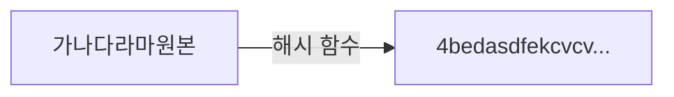
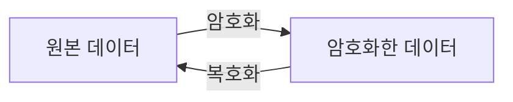

## 8장 실무에서 꼭 필요한 보안 지식

### 토큰 보안
- 보안을 위해서 토큰을 사용하는 만큼 토큰 자체의 보안에도 신경 써야 한다.
- 서버 보안을 철저히 해도 클라이언트가 보안에 취약하면 토큰이 탈취될 수 있기 때문이다.
- 토큰 탈취에 따른 보안 문제를 완화하는 방법은 토큰 유효 시간에 제한을 두는 것이다.
- 토큰 유효 시간에는 2가지 방식이 존재한다.
  - 토큰 생성 시점을 기준으로 제한 시간을 두는 방식이다.
  - 마지막 접근 시간을 기준으로 토큰 유효 시간을 정하는 것이다.


- 유효 시간과 함께 클라이언트 IP를 비교하면 토큰 보안이 향상된다.
- 보안 사고 영향을 줄이고 싶다면 토큰을 무효화해서 강제로 로그아웃시키는 기능도 필요하다.
- 토큰 데이터를 DB나 레디스와 같은 외부 저장소에 보관하면 토큰 데이터를 삭제하거나 유효하지 않은 상태로 변경해서 토큰을 무효화할 수 있다.
- 토큰 자체에 데이터를 저장하는 방식을 사용하면 클라이언트에 토큰 데이터가 저장되므로 서버에서 토큰을 무효화하기가 쉽지 않다.


### 데이터 암호화
- 암호화된 상태로 저장된 비밀번호는 설령 유출되더라도 원래 값을 알아내기 어렵고, 알아내더라도 상당한 시간이 소요된다.
- 데이터를 암호화하는 방식에는 크게 단방향 암호화와 양방향 암호화가 있다.

#### 단방향 암호화
- 단방향 암호화는 암호화한 데이터를 복호화할 수 없는 암호화 방식이다.
- 해시 함수 알고리즘에는 SHA-256, SHA-512, Bcrypt, Argon2 등이 있다.



- 단방향 암호화는 해시 함수로 생성한 해시 값이 같다면 두 데이터가 같다고 간주한다.


#### 양방향 암호화
- 양방향 암호화는 암호화와 복호화가 모두 가능한 방식이다.
- 대표적인 양방향 암호화 알고리즘으로는 AES, RSA가 있다.



- 양방향 암호화는 암호화와 복호화할 때 키를 사용하낟.
- 양방향 암호화는 대칭키 방식과 비대칭키 방식으로 나뉜다.

- 대칭키 방식
  - 암호화와 복호화할 때 동일한 키를 사용한다.
  - 암호화와 복호화를 수행하는 쌍이 같은 키를 공유해야 한다.
- 비대칭키 방식
  - 암호화할 때와 복호화할때 서로 다른 키를 공유한다.
  - 비대칭키 암호화에서는 공개 키와 개인 키를 생성한다.
  - 공개 키는 누구에게나 공개할 수 있는 키이다. 데이터를 암호화할 때 사용한다.
  - 반대로 개인 키는 소유자만 접근할 수 있어야 한다. 데이터를 복호화할 때 사용한다.


### 방화벽으로 필요한 트래픽만 허용하기
- 가장 기본적인 네트워크 접근 차단은 방화벽을 통행 ㅣ루어진다.
- 방화벽은 네트워크 통신을 두 방향으로 제어한다.
  - 인바운드 트래픽: 외부에서 내부로 유입되는 것
  - 아웃바운드 트래픽: 내부에서 외부로 유출되는 것


### 감사 로그 (audit log) 남기기
```markdown
감사 로그는 특정 작업, 절차, 사건 또는 장치에 영향을 주는 활동의 순서를 인증하는 보안 관련 기록이다. - 위키피디아
```

- 다음은 대표적인 감사 로그 기록 대상이다.
  - 사용자의 로그인/로그아웃 내역
  - 암호 초기화 등 설정 변경 내역
  - 환자 기록을 조회한 의료진 정보
  - 계약서의 수정 이력

```markdown
감사 로그와 일반 로그

감사 로그가 컴플라이언스나 정책을 지키기 위해 활동 내역을 기록한다면, 
일반 로그는 개발자나 버그나 오류 같은 문제를 해결할 때 도움을 받기 위한 목적으로 기록한다.
감사 로그는 필수로 기록해야 하는 반면,
일반 로그는 로그 레벨을 두어 필요에 따라 남기기도 하고 생략하기도 한다.
또한, 감사 로그는 규정에 정해진 기간 동안 보관해야 한다면,
일반 로그는 상황에 따라 (예: 디스크 용량 부족 등) 지우기도 한다.
```

### 데이터 노출 줄이기
- 개인 정보가 많이 표시될수록 고개 정보를 쉽게 취득할 수 있다.
- 다수의 고객 정보를 쉽게 획득하지 못하게 만드는 방법으로는 마스킹이 있다.
- 이 때 서버에서 클라이언트로 응답하는 데이터 자체가 마스킹되어 있어야 한다.
- API 응답은 원본 데이터가 보이고 프론트 코드에서만 마스킹 처리를 하면 안 된다.


### 비정상 접근 처리
- 비정상 접근으로 판단하는 대표적인 예로는 다음의 3가지가 있다.
  - 평소와 다른 장소에서 로그인함
  - 평소와 다른 기기에서 로그인함
  - 로그인에 여러 차례 실패함
- 이 3가지는 계정 관리에 대한 책임을 사용자에게만 맡기지 않고 시스템적으로 보안을 강화한다.

```markdown
브루트 포스(brute force) 공격

`특정한 암호를 풀기 위해 가능한 모든 값을 대입하는 것을 의미한다.
대부분의 암호화 방식은 이론적으로 무차별 대입 공격에 안전하지 못하며, 충분한 시간이 존재한다면 암호화된 정보를 해독할 수 있다.`
- 위키피디아
```

### 시큐어 코딩
- 서버 프로그램을 개발할 때는 아래 항목에 신경 써야 한다.
  - SQL 인젝션
  - 입력 값 검증
  - 개인 정보/민감 정보 암호화
  - 에러 메시지에 시스템 정보 미노출
  - 보안 통신
  - CORS 설정
  - CSRF 대응

```markdown
보안과 비용

보안 수준을 높일수록 비용은 증가한다.
보안 자체에 무신경하면 안된다.
최소한 인증과 인가에 신경쓰고 주요 정보를 암호화하며 서버 수준에서 방화벽이라도 설정해야 한다.
```

