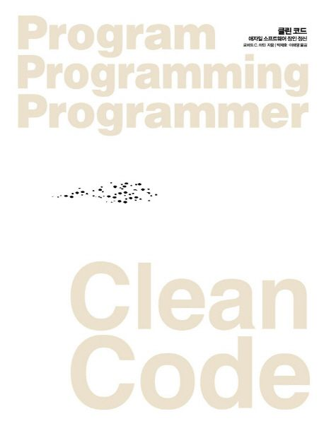

### 클린 코드



#### 정보

- 제목: 클린 코드
- 저자: 로버트 C. 마틴
- [교보문고 바로 가기](https://product.kyobobook.co.kr/detail/S000001032980)

#### 목차

- 깨끗한 코드
- 의미 있는 이름
- 함수
- 주석
- 형식 맞추기
- 객체와 자료 구조
- 오류 처리
- 경계
- 단위 테스트
- 클래스
- 시스템
- 창발성
- 동시성
- 점진적인 개선
- JUnit 들여다보기
- SerialDate 리팩터링
- 냄새와 휴리스틱

### 들어가면서 中

```
장인 정신을 익히는 과정은 두 단계로 나뉜다. 바로 이론과 실전이다.
첫째, 장인에게 필요한 원칙, 패턴, 기법, 경험이라는 지식을 습득해야 한다.
둘째, 열심히 일하고 연습해 지식을 몸과 마음으로 체득해야 한다.

...

깨끗한 코드를 작성하는 방법은 배우기 어렵다.
단순히 원칙과 패턴을 안다고 깨끗한 코드가 나오지 않는다.
고생을 해야 한다.
스스로 연습하고 실패도 맛봐야 한다.
남들이 시도하다 실패하는 모습도 봐야 한다.
그들이 넘어지고 일어서는 모습도 봐야 한다.
결정을 내리느라 고민하는 모습, 잘못된 결정으로 대가를 치르는 모습도 봐야 한다.
```
