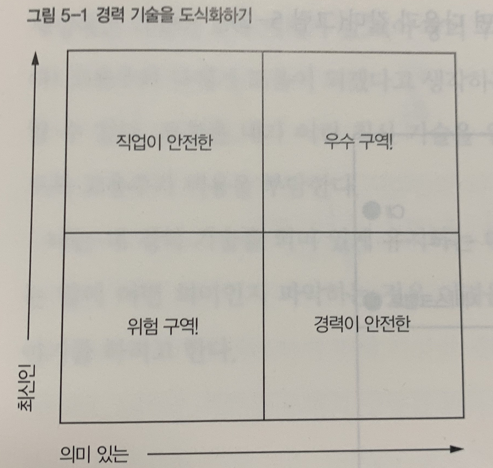

### 최신 기술, 의미 있는 기술을 익혀라

#### 목차

- 최신 기술 vs 의미 있는 기술
- 무엇이 의미 있는가
  - 능숙해지는 정도면 충분하다
  - 어디에 집중할 것인가
- 튼튼한 학습 근육 만들기
- 학습 매체
- 유의미성 평가
- 평생 매일 학습하기 위한 팁
- 실천 과제

#### 북마크



```
직업이 안전한 기술은 최신 기술이다.
즉, 현재 일자리는 유지할 수 있지만, 업계의 다른 회사에서는 의미가 없을 수 있다.
이러한 기술은 현재 상태를 지키기 위해 현재 일자리를 유지할 수 있을 정도로 관리하되 그 이상 투자하지 않는 기술이다.

경력이 안전한 기술은 업계에서 매우 의미 있는 기술이지만, 일자리를 얻을 정도의 최신 지식이 나에게 업을 수 있으며,
현재 내 일자리에서는 필요하지 않을 수도 있다.
필요할 때 최신 정보를 빠르게 익힐 방법을 알아 두긴 하지만, 적극적으로 집중하지 않는 기술이다.

위험 구역의 기술은 일자리를 유지할 정도로 최신도 아니고 업계에서도 의미가 없는 기술이다.
이러한 기술도 익혀야 하지만, 내가 하는 일에 필요한 만큼만 알면 된다.
그 수준 이상으로 능숙할 필요는 없다.

우수 구역의 기술은 업계에서 의미가 있으며, 최신 지식을 갖추고 있는 기술이다.
이러한 기술은 현재 직장에서도 사용할 수 있고 필요할 때 다른 직장에서도 사용할 수 있는 이상적인 기술이다.

-p99
```


```
고용주가 채용 시 요구하는 모든 기술을 전문가 수준으로 다룰 필요는 없다는 걸 인식하는게 중요하다.
첫째, 그러한 기술들의 적당한 부분 집합을 선택하는 것이 더 효과적이며 
둘째, 자신이 선택한 기술에 대해 기본 숙련도와 강력한 학습 근육만 갖추면 되기 때문이다.

-p104
```

```
목표로 하는 기술을 알아냈을 때 그 기술의 세계적인 전문가가 될 필요가 없다.
더 빠르게 배울 수 있도록 그 기술에 대한 기본 숙련도를 기르고 학습 능력에 대한 자신감만 갖추면 된다.

기본 숙련도란 40~80시간 정도 학습해서 배울 수 있는 지식을 의미한다.
당장 취업하기에는 부족할지 모르나, 앞으로 올바른 방향으로 학습하고 더 많은 지식을 빠르게 익혀서 일자리를 찾기에는 충분하다.
일주일에 사흘 정도 하루에 2~3시간씩 공부하면 두 달 안에 60시간 정도 학습할 수 있다.
이 정도면 적정한 수준의 기술과 지식을 얻기 위한 시간 투자로 적당하다.

-p108
```

```
SNS도 학습 자료가 될 수 있다.

...

모든 학습이 유용하다는 것이 핵심이다.
우리 모두에게 익숙한, 공식 교육 방식에만 의존할 필요는 없다.

-p113
```

```
- 매일 학습하라
인간의 뇌가 작동하는 방식을 고려하면 매일 새로운 것을 배우는 게 좋다.
그래야 학습 근육이 강력하게 유지되어 무언가 배워야 할 때 더 쉽게 배울 수 있다.

- 기술에 대한 것만 학습하지 마라
나는 매일의 학습 시간에 기술에만 집중하지 않는다.
가끔은 그냥 컴퓨터 관련 주제에서 잠시 멀어질 필요가 있다!

- 일정을 세우라
학습할 시간을 내지 않으면 건너뛰기 쉽다.
학습이 자기 경력에 어떤 가치를 더하는지 파악하고, 그 가치를 얻는 데 필요한 학습에 시간을 들이기로 약속하라.
학습은 직장에서만 하는 게 아니라는 것을 유념하라.
경력에 도움이 된다면 본인의 자유 시간을 투자해야 한다.

- 다른 사람을 끌어들여라
자신과 비슷한 입장의 동료가 있다면 작은 스터디 그룹을 만들어라.

- 무작위를 두려워 마라
학습 주제를 정할 때 시장을 충분히 분석하는 방법도 좋지만, 가끔은 주사위를 던지는 것도 두려워하지 마라.

-p116 ~ 117
```

