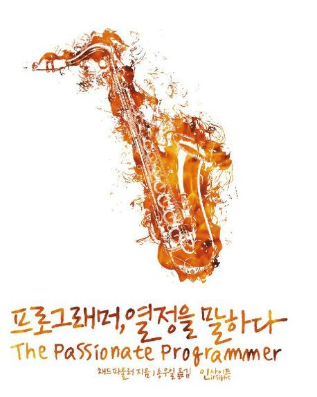

### 함께 자라기



#### 정보

- 제목: 프로그래머, 열정을 말하다
- 저자: 채드 파울러
- [교보문고 바로 가기](https://product.kyobobook.co.kr/detail/S000001032926)

#### 목차

- [당신의 시장을 선택하라](https://github.com/kiekk/book-report/blob/master/%ED%94%84%EB%A1%9C%EA%B7%B8%EB%9E%98%EB%A8%B8%2C%20%EC%97%B4%EC%A0%95%EC%9D%84%20%EB%A7%90%ED%95%98%EB%8B%A4/%EB%8B%B9%EC%8B%A0%EC%9D%98%20%EC%8B%9C%EC%9E%A5%EC%9D%84%20%EC%84%A0%ED%83%9D%ED%95%98%EB%9D%BC/README.md)
- [자신에게 투자하라](https://github.com/kiekk/book-report/blob/master/%ED%94%84%EB%A1%9C%EA%B7%B8%EB%9E%98%EB%A8%B8%2C%20%EC%97%B4%EC%A0%95%EC%9D%84%20%EB%A7%90%ED%95%98%EB%8B%A4/%EC%9E%90%EC%8B%A0%EC%97%90%EA%B2%8C%20%ED%88%AC%EC%9E%90%ED%95%98%EB%9D%BC/README.md)
- [실행](https://github.com/kiekk/book-report/blob/master/%ED%94%84%EB%A1%9C%EA%B7%B8%EB%9E%98%EB%A8%B8%2C%20%EC%97%B4%EC%A0%95%EC%9D%84%20%EB%A7%90%ED%95%98%EB%8B%A4/%EC%8B%A4%ED%96%89/README.md)
- [마케팅은 높으신 분들만 하는 게 아니다](https://github.com/kiekk/book-report/blob/master/%ED%94%84%EB%A1%9C%EA%B7%B8%EB%9E%98%EB%A8%B8%2C%20%EC%97%B4%EC%A0%95%EC%9D%84%20%EB%A7%90%ED%95%98%EB%8B%A4/%EB%A7%88%EC%BC%80%ED%8C%85%EC%9D%80%20%EB%86%92%EC%9C%BC%EC%8B%A0%20%EB%B6%84%EB%93%A4%EB%A7%8C%20%ED%95%98%EB%8A%94%20%EA%B2%8C%20%EC%95%84%EB%8B%88%EB%8B%A4/README.md)
- [자신의 강점을 유지보수하라](https://github.com/kiekk/book-report/blob/master/%ED%94%84%EB%A1%9C%EA%B7%B8%EB%9E%98%EB%A8%B8%2C%20%EC%97%B4%EC%A0%95%EC%9D%84%20%EB%A7%90%ED%95%98%EB%8B%A4/%EC%9E%90%EC%8B%A0%EC%9D%98%20%EA%B0%95%EC%A0%90%EC%9D%84%20%EC%9C%A0%EC%A7%80%EB%B3%B4%EC%88%98%ED%95%98%EB%9D%BC/README.md)

### 들어가는 글 中

```
삶이 일로써 소비된다면 일을 사랑하는 것이 삶을 사랑하는 가장 중요한 열쇠다.
일에 도전하고 동기를 부여하고 보상을 얻는 것은 따분하고 평범한 작업을 하는 것 보다
아침에 더 일어나고 싶게 만드는 것이다.

-p11

내 생각
하루 24시간 중 우리가 필수적으로 소모해야 하는 시간은 다음과 같다.
1. 휴식, 잠 - 7~8시간
2. 출퇴근 - 2~3시간
3. 근무 - 9시간

이론적으로만 계산해도 벌써 18~20시간이 소모되어 총 4~6시간만이 퇴근 후에 사용할 수 있는 시간이다.
그렇다면 일로써 소비되는 시간이 더 많기 때문에 이 시간을 더 의미있게 보내기 위해 노력해야 하는 것은 어찌보면 당연한 말같다.
```

```
자신이 그 사람들 주위에 최대한 자주 있는 유일한 방법은 그 사람들 중 하나가 되는 것이었다.
다시 말하면 함께 어울리면 내 수준을 한두 단계 올려줄 사람들 주위에 있고 싶은데, 내가 지원할 회사나 참석할 대학 과정 같은 것이 없었다.
그저 그 사람들 중 한명이 된다는 것이 무엇을 의미하는지 알아보고 그에 필요한 일을 해야 했다.
그래서 나는 스티브에게 그 사람들 중 한명이 되겠다고 선언했다.

-p14
```

`자신의 가치는 자신 주변의 5명의 평균값이다 -앤드류 테이트`