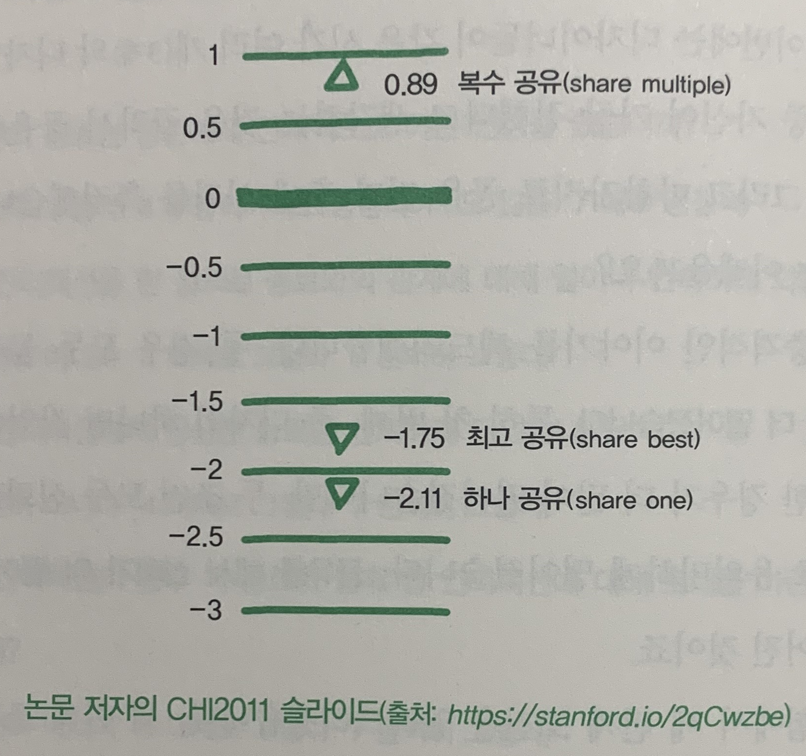

### 신뢰를 깎는 공유인가 신뢰를 쌓는 공유인가

```
신뢰 자산이 높은 조직은 커뮤니케이션 효율이나 생산성이 높다는 등의 연구가 많이 있습니다.
...
신뢰 자산이 높다는 것은 조직원들 간에 높은 수준의 신뢰가 기반되어 있는 걸 말하며, 그 신뢰가 줄거나 늘 수 있음을 암시합니다.

그러면 관심이 가는 부분은 어떻게 신뢰를 쌓을 수 있냐는 지점이 되겠죠.

...

신뢰를 쌓는 데에 널리 사용되는 한 가지 방법은 투명성과 공유, 인터랙션입니다.
자신이 한 작업물을 투명하게 서로 공유하고 그에 대해 피드백을 주고받으며 인터랙션을 하는 것이죠.
조직에서의 신뢰를 연구하는 사람들은 이런 것을 소통 신뢰라고 합니다.

...

그런데 정말 그렇게 공유하고 소통하면 신뢰가 쌓일까요?
-p129
```

