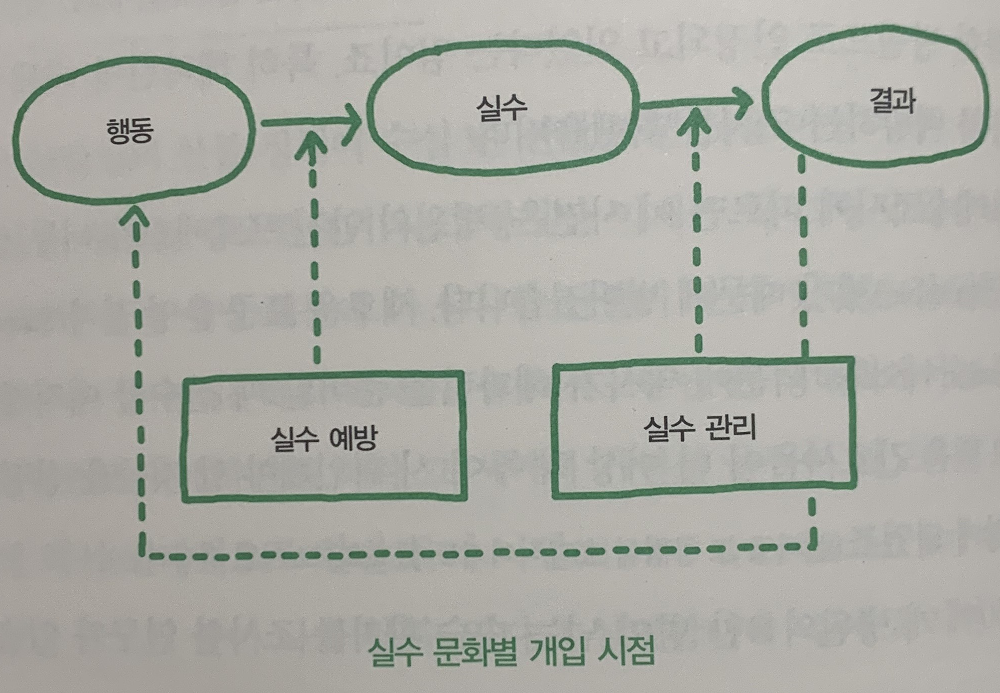

### 실수는 예방하는 것이 아니라 관리하는 것이다



```
실수 문화에는 크게 두 가지가 있습니다. 실수 예방과 실수 관리.
실수 예방은 행동에서 실수로 가는 경로를 차단하려고 합니다. 즉, 실수를 저지르지 말라고 요구합니다.
근데, 사실 이것이 불가능에 가깝습니다.
전문가도 1시간에 평균 3~5개의 실수를 저지른다고 합니다.

"실수는 어떻게든 할 수밖에 없다. 대신 그 실수가 나쁜 결과로 되기 전에 일찍 발견하고
빨리 고치면 된다"는 겁니다. 이 태도를 실수 관리라고 합니다.

...

실수 예방 문화에서는 실수를 한 사람을 비난하고, 처벌하고, 따라서 실수를 감추고 그에 대해 논의하기 꺼리며 
문제가 생겼을 때 협력도 덜하게 됩니다. 실수에서 배우지 못하겠지요.
반대로 실수 관리 문화에서는 실수가 나쁜 결과를 내기 전에 빨리 회복하도록 돕고, 실수를 공개하고,
실수에 대해 서로 이야기하고 거기에서 배우는 문화가 생깁니다.

...

실수가 없으면 학습하지 못합니다. 이는 학습이론의 기본입니다다.
즉, 실수 관리를 하는 문화일수록 학습을 더 잘합니다.

-p90 ~ 92
```

#### 내 생각

```
실수는 안하는 것이 가장 좋다는 것은 모두가 알 것입니다.
하지만 이 장에서도 언급했듯 이것은 사실상 불가능에 가깝습니다.
이런 마인드를 가진 환경이라면 실수를 한 사람을 계속해서 비난하고 피드백을 하기 때문에
실수를 한 사람은 계속해서 의욕이 줄어들고 자신감이 떨어지게 될 겁니다.
그렇게 되면 아무도 필요 이상의 일 또는 책임을 지려고 하지 않을 것이고
문제가 생겨도 그것에 나의 실수가 아니면 관심조차 가지지 않을 것입니다.

좋은 문화를 만들기 위해서는 실수를 받아들이는 자세가 필요합니다.
이 장에서 말하는 실수 관리입니다.
실수를 하는 것에 초점을 두는 것이 아니라 실수를 처리하는 것에 초점을 두면
누가 실수를 했던 간에 모두가 함께 나서서 실수를 해결하려고 할 것입니다.
그리고 그 과정들을 모두에게 공유하여 실수로부터 배우고 성장하게 될 것입니다.  
```